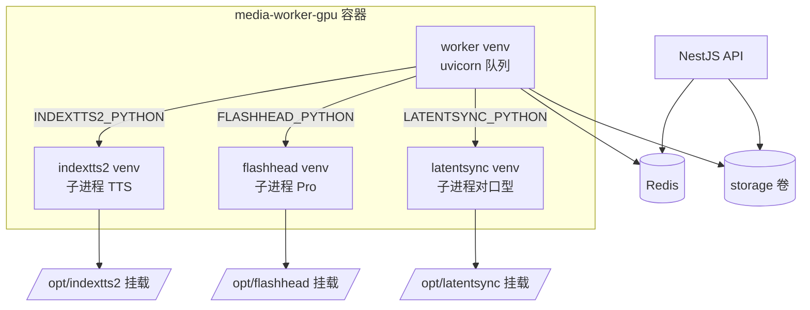

# GPU 媒体 Worker（Docker）

在 Docker 中运行 **IndexTTS2 + FlashHead Pro + LatentSync**，模型与代码**挂载宿主机目录**（与本地开发一致，不把数 GB 权重打进镜像）。

## 架构



- **四个 Python venv** 打在镜像里，避免 IndexTTS2、FlashHead 与 LatentSync 依赖冲突
- **权重与仓库** 运行时只读挂载，Lite 模型文件不会被加载

## 前置条件

1. 安装 [NVIDIA Container Toolkit](https://docs.nvidia.com/datacenter/cloud-native/container-toolkit/install-guide.html)
2. 宿主机已准备好完整目录（含代码 + 权重）：
   - IndexTTS2：如 `D:\workbench\talk\IndexTTS2`（含 `checkpoints/`）
   - FlashHead：如 `D:\workbench\FlashHeadLite`（含 `generate_video.py`、`models/`）
   - LatentSync：如 `D:\workbench\LatentSync`（含 `scripts/inference.py`、`checkpoints/latentsync_unet.pt`）
3. 验证 GPU：`docker run --rm --gpus all nvidia/cuda:12.8.1-base-ubuntu22.04 nvidia-smi`

## 配置

在项目根目录 `.env` 增加挂载路径（**宿主机绝对路径**）：

```env
# Docker GPU Worker 模型挂载（docker-compose.gpu.yml 使用）
INDEXTTS2_HOST_PATH=D:/workbench/talk/IndexTTS2
FLASHHEAD_HOST_PATH=D:/workbench/FlashHeadLite
LATENTSYNC_HOST_PATH=D:/workbench/LatentSync

MEDIA_WORKER_SECRET=change-me-media-worker-secret
LLM_API_KEY=sk-xxx
```

Linux 服务器示例：

```env
INDEXTTS2_HOST_PATH=/data/models/IndexTTS2
FLASHHEAD_HOST_PATH=/data/models/FlashHeadLite
LATENTSYNC_HOST_PATH=/data/models/LatentSync
```

## 启动

```bash
# 构建并启动全套（MySQL + Redis + API + GPU Worker）
docker compose -f docker-compose.yml -f docker-compose.gpu.yml up -d --build

# 仅重建 Worker
docker compose -f docker-compose.yml -f docker-compose.gpu.yml up -d --build media-worker
```

健康检查：

```bash
curl http://localhost:8000/health
docker logs -f viralengine-media-worker-gpu
```

## 与 CPU 版 compose 的区别

| 项目 | 默认 `docker-compose.yml` | `docker-compose.gpu.yml` |
|------|---------------------------|---------------------------|
| 镜像 | `Dockerfile` (slim CPU) | `Dockerfile.gpu` (CUDA) |
| GPU | 无 | `--gpus all` |
| TTS / 数字人 | 需自行挂载配置 | 内置双 venv + 子进程 |
| 模型 | 不内置 | 挂载 `INDEXTTS2_HOST_PATH`、`FLASHHEAD_HOST_PATH`、`LATENTSYNC_HOST_PATH` |

**不要同时跑** CPU 版与 GPU 版两个 Worker（会抢同一 Redis 队列）。使用 GPU 覆盖文件时，只会构建 GPU 版 `media-worker`。

## 首次构建说明

- 镜像构建会安装 PyTorch CUDA + 两套推理依赖，**耗时较长**（约 15–30 分钟，视网络而定）
- 模型权重不在镜像内，需提前在宿主机下载好
- 首次 TTS / FlashHead 任务仍会加载 GPU 模型，属于正常现象

## 常见问题

| 问题 | 处理 |
|------|------|
| `could not select device driver "nvidia"` | 安装 NVIDIA Container Toolkit 并重启 Docker |
| `缺少挂载目录 INDEXTTS2` | 检查 `.env` 中 `INDEXTTS2_HOST_PATH` 路径是否存在 |
| FlashHead 任务失败 | 确认挂载目录含 `generate_video.py` 与 `models/SoulX-FlashHead-1_3B/Model_Pro` |
| Windows 路径 | Docker Desktop 用 `D:/workbench/...` 正斜杠格式 |
| 显存不足 | Pro + IndexTTS2 同卡，避免并发多条 GPU 任务 |

## 相关文档

- [IndexTTS2 API](./indextts2-api.md)
- [FlashHead Pro API](./flashhead-api.md)
