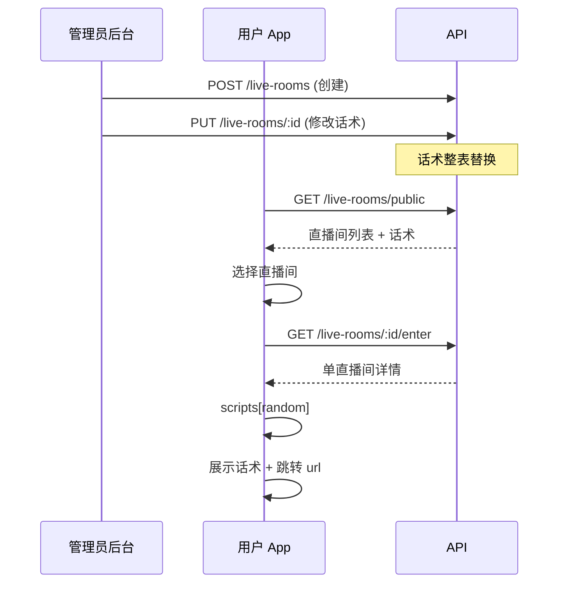

# 直播间 API 接入文档

> 版本：v1  
> 基础路径：`{API_BASE}`，默认 `http://localhost:3000/api`  
> 在线文档（Swagger）：`http://localhost:3000/api/docs`（标签 **Live Room**）  
> OpenAPI JSON：`http://localhost:3000/api/docs-json`

---

## 1. 概述

直播间 API 用于**统一管理直播地址与话术**，支持：
- 管理员配置多个直播间地址（URL）及话术
- 用户端获取直播间列表并进入，前端从话术列表中随机选用

### 接口一览

| 方法 | 路径 | 权限 | 说明 |
|------|------|------|------|
| `GET` | `/live-rooms/public` | 登录用户 | 获取全部直播间（含话术） |
| `GET` | `/live-rooms/:roomId/enter` | 登录用户 | 进入单个直播间 |
| `GET` | `/live-rooms` | 管理员 | 管理端：直播间列表 |
| `POST` | `/live-rooms` | 管理员 | 创建直播间 |
| `GET` | `/live-rooms/:roomId` | 管理员 | 直播间详情 |
| `PUT` | `/live-rooms/:roomId` | 管理员 | 更新（话术整表替换） |
| `DELETE` | `/live-rooms/:roomId` | 管理员 | 删除直播间 |

### 数据关系

```
┌──────────────┐     1:N     ┌──────────────────┐
│  live_rooms  │────────────▶│live_room_scripts │
│  - id        │             │  - id            │
│  - name      │             │  - content       │
│  - url       │             │  - sort_order    │
└──────────────┘             └──────────────────┘
```

- 每个直播间配置一个**URL**（跳转到抖音/视频号等直播间）
- 每个直播间配置**多条话术**，前端进入时随机选用

### 缓存策略（Redis）

用户端读接口（`GET /live-rooms/public`、`GET /live-rooms/:roomId/enter`）使用 **Redis 缓存 + 写时主动失效**：

| 项目 | 说明 |
|------|------|
| 缓存 Key | `live-room:public`（列表）、`live-room:enter:{roomId}`（单个直播间） |
| 读流程 | 先查 Redis → 未命中再查 MySQL → 写入 Redis |
| 失效时机 | 管理员 `POST` / `PUT` / `DELETE` 成功后**立即删除**相关缓存 |
| 兜底 TTL | 24 小时（防止漏删导致永久脏数据；正常靠写操作失效） |

**话术更新后**：管理员保存成功 → 缓存立刻清除 → 用户下一次请求拿到最新话术。

管理端读接口（`GET /live-rooms`、`GET /live-rooms/:id`）**不走缓存**，始终读数据库。

### 前置条件

客户端需先完成用户登录，取得 JWT：

| 步骤 | 接口 |
|------|------|
| 登录 | `POST /api/auth/login` |
| 或注册 | `POST /api/auth/register` |

登录成功响应中的 `accessToken` 用于后续所有接口。Swagger 调试：点击 **Authorize**，填入 `Bearer <token>`。

**管理员权限**：需在数据库将用户的 `is_admin` 设为 `1`：
```sql
UPDATE users SET is_admin = 1 WHERE phone = '13800138000';
```

---

## 2. 通用约定

### 2.1 请求头

| 接口 | Authorization | Content-Type |
|------|---------------|--------------|
| 所有接口 | `Bearer <accessToken>` | `application/json` |

### 2.2 成功响应

直接返回 JSON 对象，不额外包装 `{ data: ... }` 层。

### 2.3 错误响应

```json
{
  "statusCode": 403,
  "timestamp": "2026-06-16T08:00:00.000Z",
  "path": "/api/live-rooms",
  "message": "需要管理员权限"
}
```

| HTTP | 常见场景 |
|------|----------|
| 400 | 参数校验失败（如 URL 格式非法、scripts 为空） |
| 401 | 未登录或 Token 失效 |
| 403 | 非管理员调用管理接口 |
| 404 | 直播间不存在 |

---

## 3. 接口列表

### 3.1 用户端：获取直播间列表

**`GET /live-rooms/public`**

返回所有已配置的直播间（含话术内容列表）。前端展示列表，用户选择后进入。

#### 请求头

```http
Authorization: Bearer <accessToken>
```

#### 响应 `200`

```json
{
  "items": [
    {
      "id": "a1b2c3d4-e5f6-7890-abcd-ef1234567890",
      "name": "晚间带货专场",
      "url": "https://live.douyin.com/xxx",
      "scripts": [
        "家人们晚上好，今天直播间专属价，最后50单…",
        "手慢无，三二一上链接！",
        "感谢关注，点点小红心不迷路…"
      ]
    },
    {
      "id": "b2c3d4e5-f6a7-8901-bcde-f12345678901",
      "name": "早高峰福利场",
      "url": "https://live.kuaishou.com/xxx",
      "scripts": [
        "早上好，早餐福利来了…",
        "今天全场9.9起…"
      ]
    }
  ],
  "total": 2
}
```

#### 前端随机选话术

每次发消息前请求本接口即可；服务端已做 Redis 缓存，话术变更后会自动失效。

```typescript
const room = await fetch(`/api/live-rooms/${roomId}/enter`, {
  headers: { Authorization: `Bearer ${token}` },
}).then(r => r.json());

const script = room.scripts[Math.floor(Math.random() * room.scripts.length)];
// 展示 script，点击跳转 room.url
```

---

### 3.2 用户端：进入直播间

**`GET /live-rooms/:roomId/enter`**

获取单个直播间的完整信息（含话术），进入前调用。

#### 响应 `200`

```json
{
  "id": "a1b2c3d4-e5f6-7890-abcd-ef1234567890",
  "name": "晚间带货专场",
  "url": "https://live.douyin.com/xxx",
  "scripts": [
    "家人们晚上好…",
    "最后50单…"
  ]
}
```

---

### 3.3 管理员：直播间列表

**`GET /live-rooms`**

管理员查看全部直播间，包含话术 ID 和排序信息，便于管理。

#### 权限

需管理员身份（`isAdmin = true`），否则返回 `403`。

#### 响应 `200`

```json
{
  "items": [
    {
      "id": "a1b2c3d4-e5f6-7890-abcd-ef1234567890",
      "name": "晚间带货专场",
      "url": "https://live.douyin.com/xxx",
      "scripts": [
        {
          "id": "s1a2b3c4-d5e6-7890-abcd-ef1234567890",
          "content": "家人们晚上好…",
          "sortOrder": 0
        },
        {
          "id": "s2b3c4d5-e6f7-8901-bcde-f12345678901",
          "content": "最后50单…",
          "sortOrder": 1
        }
      ],
      "createdAt": "2026-06-16T08:00:00.000Z",
      "updatedAt": "2026-06-16T08:30:00.000Z"
    }
  ],
  "total": 1
}
```

---

### 3.4 管理员：创建直播间

**`POST /live-rooms`**

创建直播间，同时配置话术列表。

#### 请求体

```json
{
  "name": "晚间带货专场",
  "url": "https://live.douyin.com/xxx",
  "scripts": [
    "家人们晚上好，今天直播间专属价，最后50单…",
    "手慢无，三二一上链接！",
    "感谢关注，点点小红心不迷路…"
  ]
}
```

| 字段 | 类型 | 必填 | 限制 |
|------|------|------|------|
| `name` | string | 是 | 1-128 字符 |
| `url` | string | 是 | 合法 URL，1-1024 字符 |
| `scripts` | string[] | 是 | 至少 1 条，最多 100 条，每条 ≤5000 字符 |

#### 响应 `201`

返回创建后的直播间详情（含话术 ID）：

```json
{
  "id": "a1b2c3d4-e5f6-7890-abcd-ef1234567890",
  "name": "晚间带货专场",
  "url": "https://live.douyin.com/xxx",
  "scripts": [
    {
      "id": "s1a2b3c4-d5e6-7890-abcd-ef1234567890",
      "content": "家人们晚上好…",
      "sortOrder": 0
    }
  ],
  "createdAt": "2026-06-16T08:00:00.000Z",
  "updatedAt": "2026-06-16T08:00:00.000Z"
}
```

---

### 3.5 管理员：查看直播间详情

**`GET /live-rooms/:roomId`**

#### 响应 `200`

与列表项格式一致：

```json
{
  "id": "a1b2c3d4-e5f6-7890-abcd-ef1234567890",
  "name": "晚间带货专场",
  "url": "https://live.douyin.com/xxx",
  "scripts": [
    {
      "id": "s1a2b3c4-d5e6-7890-abcd-ef1234567890",
      "content": "家人们晚上好…",
      "sortOrder": 0
    }
  ],
  "createdAt": "2026-06-16T08:00:00.000Z",
  "updatedAt": "2026-06-16T08:30:00.000Z"
}
```

---

### 3.6 管理员：更新直播间

**`PUT /live-rooms/:roomId`**

⚠️ **话术整表替换**：请求体中的 `scripts` 会**完全覆盖**原有话术。

- 数组中有 `content` 的就作为新话术插入
- 旧话术全部删除
- `sortOrder` 按数组下标 0, 1, 2... 自动设置

#### 请求体

```json
{
  "name": "晚间带货专场-改名",
  "url": "https://live.douyin.com/new-url",
  "scripts": [
    "新话术一",
    "新话术二",
    "新话术三"
  ]
}
```

#### 响应 `200`

返回更新后的直播间详情：

```json
{
  "id": "a1b2c3d4-e5f6-7890-abcd-ef1234567890",
  "name": "晚间带货专场-改名",
  "url": "https://live.douyin.com/new-url",
  "scripts": [
    {
      "id": "s9f8e7d6-c5b4-a321-0fed-cba987654321",
      "content": "新话术一",
      "sortOrder": 0
    },
    {
      "id": "s8e7d6c5-b4a3-2109-fedc-ba9876543210",
      "content": "新话术二",
      "sortOrder": 1
    }
  ],
  "createdAt": "2026-06-16T08:00:00.000Z",
  "updatedAt": "2026-06-16T09:00:00.000Z"
}
```

---

### 3.7 管理员：删除直播间

**`DELETE /live-rooms/:roomId`**

删除直播间，关联的话术会级联删除。

#### 响应 `204`

无响应体。

---

## 4. TypeScript 类型参考

```typescript
interface LiveRoomPublic {
  id: string;
  name: string;
  url: string;
  scripts: string[]; // 话术内容数组
}

interface LiveRoomPublicListResponse {
  items: LiveRoomPublic[];
  total: number;
}

interface LiveRoomScript {
  id: string;
  content: string;
  sortOrder: number;
}

interface LiveRoomDetail {
  id: string;
  name: string;
  url: string;
  scripts: LiveRoomScript[];
  createdAt: string;
  updatedAt: string;
}

interface LiveRoomListResponse {
  items: LiveRoomDetail[];
  total: number;
}

type SaveLiveRoomDto = {
  name: string;
  url: string;
  scripts: string[];
};
```

---

## 5. 前后端交互流程



---

## 6. 数据库表结构（参考）

```sql
-- 直播间
CREATE TABLE live_rooms (
  id VARCHAR(36) PRIMARY KEY,
  name VARCHAR(128) NOT NULL,
  url VARCHAR(1024) NOT NULL,
  created_at DATETIME DEFAULT CURRENT_TIMESTAMP,
  updated_at DATETIME DEFAULT CURRENT_TIMESTAMP ON UPDATE CURRENT_TIMESTAMP
);

-- 话术
CREATE TABLE live_room_scripts (
  id VARCHAR(36) PRIMARY KEY,
  room_id VARCHAR(36) NOT NULL,
  content TEXT NOT NULL,
  sort_order INT DEFAULT 0,
  created_at DATETIME DEFAULT CURRENT_TIMESTAMP,
  updated_at DATETIME DEFAULT CURRENT_TIMESTAMP ON UPDATE CURRENT_TIMESTAMP,
  FOREIGN KEY (room_id) REFERENCES live_rooms(id) ON DELETE CASCADE,
  INDEX idx_room_sort (room_id, sort_order)
);

-- 用户表增加管理员字段
ALTER TABLE users ADD COLUMN is_admin TINYINT(1) DEFAULT 0;
```
