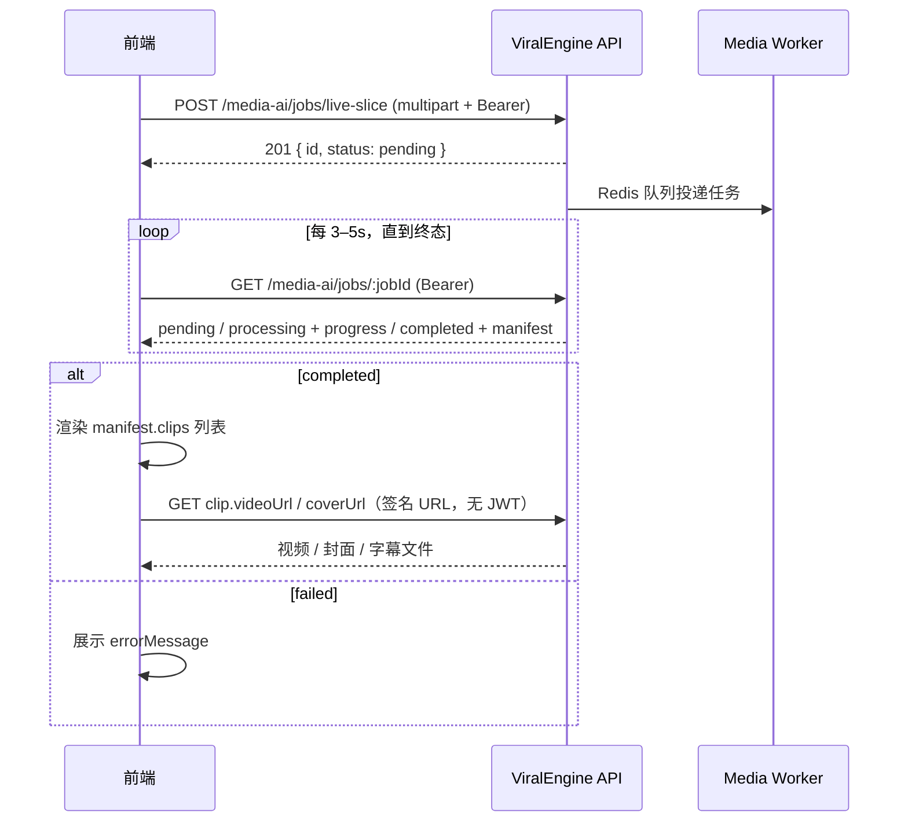

# 直播切片 API 接入文档

> 版本：v1  
> 基础路径：`{API_BASE}`，默认 `http://localhost:3000/api`  
> 在线文档（Swagger）：`http://localhost:3000/api/docs`（标签 **Media AI**）  
> OpenAPI JSON：`http://localhost:3000/api/docs-json`

---

## 1. 概述

直播切片 API 用于上传**长直播录像**，由服务端自动识别卖货高光片段，输出多条竖屏短视频素材。

本文档**仅包含直播切片**所需接口，不含字幕识别、加水印、发布草稿等其他能力。

### 接口一览

| 方法 | 路径 | 说明 |
|------|------|------|
| `POST` | `/media-ai/jobs/live-slice` | 创建切片任务 |
| `GET` | `/media-ai/jobs/:jobId` | 查询进度与结果 |
| `GET` | `/media-ai/assets/content?...` | 下载切片文件（签名 URL） |
| `DELETE` | `/media-ai/jobs/:jobId` | 删除任务、释放存储 |

### 能力说明

| 项目 | 说明 |
|------|------|
| 任务类型 | `live_slice` |
| 识别流程 | FunASR 语音转写 → 场景边界对齐 → LLM 高光识别 → ffmpeg 切片 |
| 输出内容 | 每条切片含：**视频**、**封面**、**SRT 字幕**、标题/话题/标签/关联商品 |
| 画面比例 | 默认输出 **9:16** 竖屏，可改为 `original` 保持原比例 |
| 处理方式 | 异步任务：创建后立即返回任务 ID，需轮询状态 |
| 用户隔离 | 任务归属当前登录用户，**禁止**客户端传 `userId` |

### 前置条件

客户端需先完成用户登录，取得 JWT：

| 步骤 | 接口 |
|------|------|
| 登录 | `POST /api/auth/login` |
| 或注册 | `POST /api/auth/register` |

登录成功响应中的 `accessToken` 用于后续所有直播切片接口。

服务端还需运行 **Media Worker**（Python）处理队列任务，否则任务会长期停留在 `pending` 状态。

---

## 2. 通用约定

### 2.1 请求头

| 接口 | Authorization | Content-Type |
|------|---------------|--------------|
| 创建切片任务 | `Bearer <accessToken>` | `multipart/form-data` |
| 查询任务状态 | `Bearer <accessToken>` | 无（GET） |
| 删除任务 | `Bearer <accessToken>` | 无（DELETE） |
| 下载切片文件（签名 URL） | **不需要** JWT | 无（GET） |

Swagger 调试：点击 **Authorize**，填入 `Bearer <token>`。

### 2.2 成功响应

直接返回 JSON 对象，**不**额外包装 `{ data: ... }` 层。

### 2.3 错误响应

```json
{
  "statusCode": 400,
  "timestamp": "2026-05-30T08:00:00.000Z",
  "path": "/api/media-ai/jobs/live-slice",
  "message": "minDuration 不能大于 maxDuration"
}
```

参数校验失败时，`message` 可能为字符串数组。

| HTTP | 常见场景 |
|------|----------|
| 400 | 未上传文件、视频格式不支持、`cartItems` JSON 非法、`minDuration > maxDuration` |
| 401 | 未登录或 Token 失效 |
| 404 | 任务不存在或不属于当前用户 |
| 422 | 表单字段校验失败（如 `aspectRatio` 非法） |

### 2.4 TypeScript 类型（与前端对齐）

```typescript
type LiveSliceJobStatus = 'pending' | 'processing' | 'completed' | 'failed';

type LiveSliceAspectRatio = 'original' | '9:16';

/** 传给服务端的商品信息（用于 ASR 热词 + 高光关联） */
interface LiveSliceCartItem {
  id?: string;
  title: string;
  link?: string;
}

interface LiveSliceClip {
  id: string;
  startSec: number;
  endSec: number;
  durationSec: number;
  /** 0–1，越高表示越适合发布 */
  score: number;
  reason: string;
  productName?: string;
  productId?: string;
  title: string;
  description?: string;
  topics: string[];
  tags: string[];
  /** 签名下载 URL，仅 status=completed 时有值 */
  videoUrl?: string;
  coverUrl?: string;
  subtitleUrl?: string;
}

interface LiveSliceManifest {
  version: number;
  sourceDurationSec: number;
  /** 实际使用的 ASR 引擎，如 funasr / whisper */
  asrEngine: string;
  clips: LiveSliceClip[];
}

interface LiveSliceJobResponse {
  id: string;
  type: 'live_slice';
  status: LiveSliceJobStatus;
  /** 0–100；live_slice 处理过程中会阶段性更新 */
  progress: number;
  inputUrl?: string;
  /** manifest.json 的签名 URL；完成前下载可能 404 */
  outputUrl?: string;
  errorMessage?: string;
  createdAt: string;
  updatedAt: string;
  startedAt?: string;
  completedAt?: string;
  /** 仅 type=live_slice 且 status=completed 时返回 */
  manifest?: LiveSliceManifest;
}

interface CreateLiveSliceJobForm {
  /** 直播录像，字段名必须为 file */
  file: File;
  /** 切片最短秒数，默认 15，范围 5–120 */
  minDuration?: number;
  /** 切片最长秒数，默认 60，范围 10–180 */
  maxDuration?: number;
  /** 最多输出条数，默认 20，范围 1–50 */
  maxClips?: number;
  /** 默认 9:16 */
  aspectRatio?: LiveSliceAspectRatio;
  /** 语言代码，留空自动检测，如 zh */
  language?: string;
  /** 商品列表，用于热词与高光关联 */
  cartItems?: LiveSliceCartItem[];
  /** 自定义高光策略（追加到系统 Prompt） */
  highlightPrompt?: string;
}
```

---

## 3. 接口列表

### 3.1 创建直播切片任务

**`POST /media-ai/jobs/live-slice`**

上传长直播录像并创建异步切片任务。

#### 请求

`Content-Type: multipart/form-data`

| 字段 | 类型 | 必填 | 说明 |
|------|------|------|------|
| `file` | File | 是 | 视频文件，表单字段名**必须为** `file` |
| `minDuration` | number | 否 | 最短切片秒数，默认 `15` |
| `maxDuration` | number | 否 | 最长切片秒数，默认 `60` |
| `maxClips` | number | 否 | 最多输出条数，默认 `20` |
| `aspectRatio` | string | 否 | `9:16`（默认）或 `original` |
| `language` | string | 否 | 语言代码，留空自动检测 |
| `cartItems` | string | 否 | **JSON 字符串**，商品数组，见下方示例 |
| `highlightPrompt` | string | 否 | 自定义高光识别策略 |

> `cartItems` 在 multipart 中须传 **字符串**，不能传嵌套对象。前端应 `JSON.stringify(cartItems)` 后再 append。

**cartItems 示例（JSON 字符串内容）：**

```json
[
  { "id": "sku-001", "title": "玻尿酸面膜", "link": "https://example.com/p/1" },
  { "id": "sku-002", "title": "防晒霜 SPF50", "link": "" }
]
```

#### 支持的视频 MIME 类型

| MIME | 常见扩展名 |
|------|------------|
| `video/mp4` | `.mp4` |
| `video/quicktime` | `.mov` |
| `video/webm` | `.webm` |
| `video/x-msvideo` | `.avi` |

#### 响应 `201`

```json
{
  "id": "a1b2c3d4-e5f6-7890-abcd-ef1234567890",
  "type": "live_slice",
  "status": "pending",
  "progress": 0,
  "inputUrl": "http://localhost:3000/api/media-ai/assets/content?key=...&expires=...&sig=...",
  "outputUrl": "http://localhost:3000/api/media-ai/assets/content?key=...&expires=...&sig=...",
  "createdAt": "2026-05-30T08:00:00.000Z",
  "updatedAt": "2026-05-30T08:00:00.000Z"
}
```

| 字段 | 说明 |
|------|------|
| `id` | 任务 UUID，用于后续轮询 |
| `type` | 固定为 `live_slice` |
| `status` | 初始为 `pending` |
| `outputUrl` | manifest.json 占位路径；**任务完成前下载可能 404** |

#### 错误示例

| message | 原因 |
|---------|------|
| `请上传视频文件` | 未传 `file` 或文件为空 |
| `不支持的视频格式` | MIME 不在白名单内 |
| `cartItems 必须是合法 JSON 数组` | `cartItems` 不是有效 JSON |
| `cartItems[0].title 必填` | 商品缺少 title |
| `minDuration 不能大于 maxDuration` | 时长参数冲突 |

#### cURL 示例

```bash
curl -X POST "http://localhost:3000/api/media-ai/jobs/live-slice" \
  -H "Authorization: Bearer <accessToken>" \
  -F "file=@/path/to/live-recording.mp4" \
  -F "minDuration=15" \
  -F "maxDuration=60" \
  -F "maxClips=20" \
  -F "aspectRatio=9:16" \
  -F 'cartItems=[{"id":"sku-001","title":"玻尿酸面膜","link":""}]'
```

---

### 3.2 查询任务状态

**`GET /media-ai/jobs/:jobId`**

轮询切片进度；任务完成后响应中会附带 `manifest` 字段（含各切片下载 URL）。

#### 路径参数

| 参数 | 说明 |
|------|------|
| `jobId` | 创建任务时返回的 `id` |

#### 响应 `200`

处理中（有阶段性进度）：

```json
{
  "id": "a1b2c3d4-e5f6-7890-abcd-ef1234567890",
  "type": "live_slice",
  "status": "processing",
  "progress": 55,
  "inputUrl": "http://localhost:3000/api/media-ai/assets/content?key=...",
  "outputUrl": "http://localhost:3000/api/media-ai/assets/content?key=...",
  "createdAt": "2026-05-30T08:00:00.000Z",
  "updatedAt": "2026-05-30T08:02:10.000Z",
  "startedAt": "2026-05-30T08:00:05.000Z"
}
```

成功：

```json
{
  "id": "a1b2c3d4-e5f6-7890-abcd-ef1234567890",
  "type": "live_slice",
  "status": "completed",
  "progress": 100,
  "outputUrl": "http://localhost:3000/api/media-ai/assets/content?key=...",
  "createdAt": "2026-05-30T08:00:00.000Z",
  "updatedAt": "2026-05-30T08:05:30.000Z",
  "startedAt": "2026-05-30T08:00:05.000Z",
  "completedAt": "2026-05-30T08:05:30.000Z",
  "manifest": {
    "version": 1,
    "sourceDurationSec": 3600.5,
    "asrEngine": "funasr",
    "clips": [
      {
        "id": "clip-001",
        "startSec": 120.5,
        "endSec": 175.2,
        "durationSec": 54.7,
        "score": 0.92,
        "reason": "完整介绍产品+限时价格",
        "productName": "玻尿酸面膜",
        "productId": "sku-001",
        "title": "99两盒限时！",
        "description": "今天直播间专属价，最后50单…",
        "topics": ["护肤", "直播好物"],
        "tags": ["#面膜", "#限时"],
        "videoUrl": "http://localhost:3000/api/media-ai/assets/content?key=...",
        "coverUrl": "http://localhost:3000/api/media-ai/assets/content?key=...",
        "subtitleUrl": "http://localhost:3000/api/media-ai/assets/content?key=..."
      }
    ]
  }
}
```

失败：

```json
{
  "id": "a1b2c3d4-e5f6-7890-abcd-ef1234567890",
  "type": "live_slice",
  "status": "failed",
  "progress": 30,
  "errorMessage": "未识别到有效口播内容，无法生成切片",
  "createdAt": "2026-05-30T08:00:00.000Z",
  "updatedAt": "2026-05-30T08:01:00.000Z",
  "startedAt": "2026-05-30T08:00:05.000Z",
  "completedAt": "2026-05-30T08:01:00.000Z"
}
```

#### 任务状态流转

```
pending → processing → completed
                    ↘ failed
```

| status | 含义 | 前端建议 |
|--------|------|----------|
| `pending` | 已入队，等待 Worker | 继续轮询 |
| `processing` | 正在转写/分析/切片 | 展示 `progress` 进度条 |
| `completed` | 切片成功 | 读取 `manifest.clips` 渲染列表 |
| `failed` | 处理失败 | 展示 `errorMessage`，允许重试 |

#### progress 参考阶段

| progress 区间 | 阶段 |
|---------------|------|
| 0–10 | 音频提取 / ASR 开始 |
| 10–30 | 语音转写 |
| 30–55 | 场景检测 + 高光分析 |
| 55–90 | 逐条切片、封面、字幕 |
| 100 | 完成 |

> 长直播（1–2 小时）处理可能需要数分钟至数十分钟，建议轮询间隔 **3–5 秒**，总超时设为 **60–120 分钟**。

---

### 3.3 下载切片文件（签名 URL）

**`GET /media-ai/assets/content?key=&expires=&sig=`**

`manifest.clips[].videoUrl` / `coverUrl` / `subtitleUrl` 以及 `outputUrl` 均为签名 URL，**无需 JWT**。

#### 用法

```typescript
// 封面：

// 视频：直接用签名 URL 作为 src（服务端已支持 Range 流式播放）
<video src={clip.videoUrl} controls preload="metadata" />

// 如需用 canvas 截帧等，可加 crossOrigin
<video src={clip.videoUrl} controls crossOrigin="anonymous" />

// 下载为 Blob 保存到本地
const videoBlob = await fetch(clip.videoUrl!).then((r) => r.blob());
```

> **页面播放失败、但下载正常？** 通常是旧版接口未支持 HTTP Range 或跨域 CORP 限制。请确保 API 已更新，并重新 `GET /jobs/:jobId` 刷新签名 URL。  
> **2026-05-30 之后新生成的切片** 已启用 `faststart` 编码，浏览器兼容性更好；旧切片若仍无法播放，请重新跑一遍切片任务。

#### 签名 URL 说明

| 参数 | 说明 |
|------|------|
| `key` | 存储路径（服务端内部 key） |
| `expires` | Unix 秒级过期时间 |
| `sig` | HMAC 签名 |

- 默认有效期 **3600 秒**（1 小时）
- **每次调用** `GET /media-ai/jobs/:jobId` 都会重新生成签名 URL
- 签名过期后需重新查询任务接口获取新 URL

---

### 3.4 删除任务（释放存储）

**`DELETE /media-ai/jobs/:jobId`**

前端下载并保存切片后调用，**立即删除**该任务所有文件并移除任务记录。

#### 响应

- `204 No Content`：删除成功
- `404`：任务不存在或不属于当前用户

> 若不调用 DELETE，产出文件在 `completed` 后默认保留 **12 小时**，由服务端定时清理。

---

## 4. 推荐接入流程



### 完整 TypeScript 示例

```typescript
const API_BASE = 'http://localhost:3000/api';

async function createLiveSliceJob(
  accessToken: string,
  videoFile: File,
  options?: Omit<CreateLiveSliceJobForm, 'file'>,
): Promise<LiveSliceJobResponse> {
  const form = new FormData();
  form.append('file', videoFile);

  if (options?.minDuration != null) {
    form.append('minDuration', String(options.minDuration));
  }
  if (options?.maxDuration != null) {
    form.append('maxDuration', String(options.maxDuration));
  }
  if (options?.maxClips != null) {
    form.append('maxClips', String(options.maxClips));
  }
  if (options?.aspectRatio) {
    form.append('aspectRatio', options.aspectRatio);
  }
  if (options?.language) {
    form.append('language', options.language);
  }
  if (options?.cartItems?.length) {
    form.append('cartItems', JSON.stringify(options.cartItems));
  }
  if (options?.highlightPrompt) {
    form.append('highlightPrompt', options.highlightPrompt);
  }

  const res = await fetch(`${API_BASE}/media-ai/jobs/live-slice`, {
    method: 'POST',
    headers: { Authorization: `Bearer ${accessToken}` },
    body: form,
  });

  if (!res.ok) {
    const err = await res.json().catch(() => ({}));
    throw new Error(err.message ?? '创建切片任务失败');
  }

  return res.json();
}

async function pollLiveSliceJob(
  accessToken: string,
  jobId: string,
  options?: {
    intervalMs?: number;
    timeoutMs?: number;
    onProgress?: (job: LiveSliceJobResponse) => void;
  },
): Promise<LiveSliceJobResponse> {
  const intervalMs = options?.intervalMs ?? 4000;
  const deadline = Date.now() + (options?.timeoutMs ?? 120 * 60 * 1000);
  const headers = { Authorization: `Bearer ${accessToken}` };

  while (Date.now() < deadline) {
    const res = await fetch(`${API_BASE}/media-ai/jobs/${jobId}`, { headers });
    if (!res.ok) throw new Error('查询任务失败');

    const job: LiveSliceJobResponse = await res.json();
    options?.onProgress?.(job);

    if (job.status === 'completed') {
      if (!job.manifest?.clips?.length) {
        throw new Error('切片完成但未返回 clips');
      }
      return job;
    }

    if (job.status === 'failed') {
      throw new Error(job.errorMessage ?? '直播切片失败');
    }

    await new Promise((r) => setTimeout(r, intervalMs));
  }

  throw new Error('直播切片超时');
}

/** 一键：上传 + 轮询 + 返回切片列表 */
async function runLiveSlice(
  accessToken: string,
  videoFile: File,
  options?: CreateLiveSliceJobForm & {
    onProgress?: (progress: number, status: LiveSliceJobStatus) => void;
  },
): Promise<LiveSliceClip[]> {
  const { file: _f, onProgress, ...sliceOptions } = options ?? { file: videoFile };

  const created = await createLiveSliceJob(accessToken, videoFile, sliceOptions);

  const completed = await pollLiveSliceJob(accessToken, created.id, {
    onProgress: (job) => onProgress?.(job.progress, job.status),
  });

  return completed.manifest!.clips;
}
```

### React 上传要点

```typescript
// 1. 不要手动设置 Content-Type，浏览器会自动带 multipart boundary
const formData = new FormData();
formData.append('file', file);

// 2. cartItems 必须 JSON.stringify
formData.append(
  'cartItems',
  JSON.stringify([{ id: '1', title: '面膜', link: '' }]),
);

// 3. 数字字段传字符串即可，服务端会自动转换
formData.append('minDuration', '15');
formData.append('maxDuration', '60');

await fetch(`${API_BASE}/media-ai/jobs/live-slice`, {
  method: 'POST',
  headers: { Authorization: `Bearer ${token}` },
  body: formData,
});
```

### UI 展示建议

```typescript
function ClipCard({ clip }: { clip: LiveSliceClip }) {
  return (
    <div>
      
      <video src={clip.videoUrl} controls preload="metadata" />
      <h3>{clip.title}</h3>
      <p>{clip.description}</p>
      <span>评分 {(clip.score * 100).toFixed(0)}%</span>
      <span>{clip.startSec}s – {clip.endSec}s</span>
      {clip.productName && <span>关联商品：{clip.productName}</span>}
      <div>{clip.tags.map((t) => <span key={t}>{t}</span>)}</div>
    </div>
  );
}
```

---

## 5. 常见问题

| 问题 | 说明 |
|------|------|
| 任务一直 `pending` | Media Worker 未启动或未连上 Redis |
| `clips` 为空或质量差 | 检查 Worker 是否配置 `LLM_API_KEY`；未配置时仅用规则引擎 |
| 处理很慢 | 长直播 + CPU 模式正常；生产建议 GPU |
| 签名 URL 404 | URL 已过期，重新 `GET /jobs/:jobId` 刷新 |
| 竖屏画面被裁切 | 默认 `9:16` 居中裁剪；横屏原片可传 `aspectRatio=original` |
