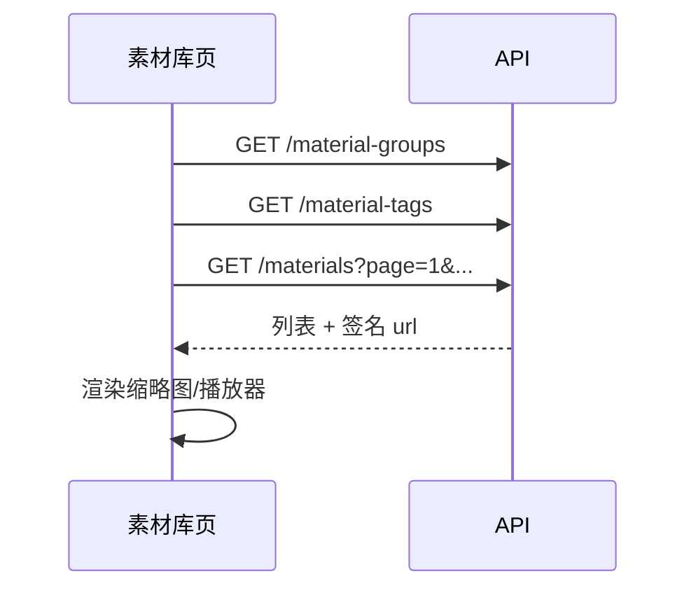

# 素材库 API 接入文档

> 版本：v1  
> 基础路径：`{API_BASE}`，默认 `http://localhost:3000/api`  
> 在线文档（Swagger）：`http://localhost:3000/api/docs`（标签 **Material Library** / **Material Library Assets**）  
> OpenAPI JSON：`http://localhost:3000/api/docs-json`

---

## 1. 概述

素材库 API 用于管理用户上传的**图片、音频、视频**素材，支持自定义**分组**与**标签**，供剪辑、发布等业务模块引用。

### 1.1 能力边界（v1）

| 能力 | v1 | 说明 |
|------|-----|------|
| 上传图片 / 音频 / 视频 | ✅ | 按 MIME 或扩展名识别类型 |
| 关联分组 | ✅ | 可选；每个素材最多属于一个分组 |
| 关联标签 | ✅ | 可选；每个素材可关联多个标签 |
| 分组 / 标签 CRUD | ✅ | 用户自定义增删改 |
| 素材永久保留 | ✅ | **无**自动过期清理；仅用户 `DELETE` 时删除文件 |
| 替换已上传文件 | ❌ | 仅可更新元数据（名称、分组、标签） |
| 跨用户共享素材 | ❌ | 数据按 JWT 用户隔离 |

### 1.2 与 Media AI 产出的区别

| 对比项 | 素材库 | Media AI 任务产出 |
|--------|--------|-------------------|
| 保留策略 | 永久（用户删才删） | 完成后按 `MEDIA_JOB_OUTPUT_RETENTION_HOURS` 自动清理 |
| 典型用途 | 用户主动上传的原始素材 | TTS、口型、字幕等 AI 生成结果 |

### 1.3 前置条件

客户端需先完成用户登录，取得 JWT：

| 步骤 | 接口 |
|------|------|
| 登录 | `POST /api/auth/login` |
| 或注册 | `POST /api/auth/register` |

---

## 2. 通用约定

### 2.1 请求头

**JSON 接口**（分组、标签、素材元数据）：

```http
Authorization: Bearer <accessToken>
Content-Type: application/json
```

**上传接口**（`POST /materials`）：

```http
Authorization: Bearer <accessToken>
Content-Type: multipart/form-data
```

**素材文件访问**（签名 URL，**无需** JWT）：

```http
GET {url 字段中的完整地址}
```

Swagger 调试：点击 **Authorize**，填入 `Bearer <token>`。

### 2.2 成功响应

直接返回 JSON 对象，**不**额外包装 `{ data: ... }` 层。

删除成功：`204 No Content`，无响应体。

### 2.3 错误响应

```json
{
  "statusCode": 400,
  "timestamp": "2026-06-06T08:00:00.000Z",
  "path": "/api/materials",
  "message": "素材数量已达上限（500）"
}
```

参数校验失败时，`message` 可能为字符串数组。

| HTTP | 常见场景 |
|------|----------|
| 400 | 未上传文件、素材数量达上限 |
| 401 | 未登录、Token 失效、签名 URL 无效或过期 |
| 404 | 素材 / 分组 / 标签不存在 |
| 409 | 标签名称重复（同用户下唯一） |
| 413 | 文件超过大小限制 |
| 422 | 不支持的文件格式、请求体字段校验失败 |

### 2.4 素材访问 URL（签名）

列表与详情中的 `url` 为**短时签名链接**，形如：

```text
http://localhost:3000/api/material-assets/content?key=<storageKey>&expires=<unix>&sig=<hmac>
```

| 项 | 说明 |
|----|------|
| 有效期 | 默认 3600 秒（`STORAGE_SIGNED_URL_TTL`） |
| 过期后 | 需重新请求列表/详情获取新 `url` |
| Range | 支持 `Range: bytes=0-` 流式播放视频/音频 |
| 用途 | 可直接作为 ``、`<video src>`、`<audio src>` |

生产环境请配置 `STORAGE_PUBLIC_BASE_URL`，确保客户端能访问到 API 域名。

### 2.5 支持的文件类型

| type | 扩展名 | 默认大小上限 |
|------|--------|--------------|
| `image` | jpg, jpeg, png, webp, gif, bmp | 10 MB |
| `audio` | wav, mp3, flac, ogg, m4a, aac | 100 MB |
| `video` | mp4, mov, webm, avi, ts | 4 GB |

可通过环境变量调整：`MATERIAL_IMAGE_MAX_BYTES`、`MATERIAL_AUDIO_MAX_BYTES`、`MATERIAL_VIDEO_MAX_BYTES`。

### 2.6 TypeScript 类型

```typescript
type MaterialType = 'image' | 'audio' | 'video';

interface MaterialTagSummary {
  id: string;
  name: string;
}

interface MaterialGroupSummary {
  id: string;
  name: string;
  description: string | null;
  sortOrder: number;
  materialCount: number;
  createdAt: string; // ISO 8601
  updatedAt: string;
}

interface MaterialSummary {
  id: string;
  type: MaterialType;
  name: string;
  groupId: string | null;
  groupName?: string | null;
  tags: MaterialTagSummary[];
  mimeType: string;
  fileName: string;
  fileSize: string;   // 字节数，字符串形式（bigint 序列化）
  url: string;        // 签名访问 URL
  createdAt: string;
  updatedAt: string;
}

interface MaterialListResponse {
  items: MaterialSummary[];
  total: number;
  page: number;
  pageSize: number;
}

interface MaterialGroupListResponse {
  items: MaterialGroupSummary[];
}

interface MaterialTagListResponse {
  items: MaterialTagSummary[];
  materialCount: number; // 标签关联总次数（非去重素材数）
}

interface MaterialTagDetail extends MaterialTagSummary {
  materialCount: number;
  createdAt: string;
  updatedAt: string;
}

interface SaveMaterialGroupBody {
  name: string;
  description?: string;
  sortOrder?: number; // 默认 0，越小越靠前
}

interface SaveMaterialTagBody {
  name: string;
}

interface UpdateMaterialBody {
  name?: string;
  groupId?: string | null; // null 表示取消分组
  tagIds?: string[];       // [] 表示清除所有标签
}
```

---

## 3. 接口列表

### 3.1 素材

#### 3.1.1 素材列表

**`GET /materials`**

**Query 参数**

| 参数 | 类型 | 默认 | 说明 |
|------|------|------|------|
| page | number | 1 | 页码，≥ 1 |
| pageSize | number | 20 | 每页条数，1–50 |
| groupId | string (UUID) | — | 按分组筛选 |
| tagId | string (UUID) | — | 按标签筛选（含该标签的素材） |
| type | `image` \| `audio` \| `video` | — | 按类型筛选 |
| keyword | string | — | 按名称模糊搜索，最长 128 |

**请求示例**

```http
GET /api/materials?page=1&pageSize=20&type=video&keyword=开箱
Authorization: Bearer <token>
```

**响应示例**

```json
{
  "items": [
    {
      "id": "550e8400-e29b-41d4-a716-446655440000",
      "type": "video",
      "name": "草原开箱.mp4",
      "groupId": "7c9e6679-7425-40de-944b-e07fc1f90ae7",
      "groupName": "带货素材",
      "tags": [
        { "id": "aa11bb22-cc33-dd44-ee55-ff6677889900", "name": "开箱" }
      ],
      "mimeType": "video/mp4",
      "fileName": "video-1749206400000-abc123.mp4",
      "fileSize": "52428800",
      "url": "http://localhost:3000/api/material-assets/content?key=...&expires=...&sig=...",
      "createdAt": "2026-06-06T08:00:00.000Z",
      "updatedAt": "2026-06-06T08:00:00.000Z"
    }
  ],
  "total": 1,
  "page": 1,
  "pageSize": 20
}
```

排序：按 `updatedAt` 降序（最近更新在前）。

---

#### 3.1.2 素材详情

**`GET /materials/:materialId`**

**响应**：与列表项结构相同（`MaterialSummary`）。

**错误**：素材不存在或不属于当前用户 → `404`。

---

#### 3.1.3 上传素材

**`POST /materials`**

`Content-Type: multipart/form-data`

| 字段 | 类型 | 必填 | 说明 |
|------|------|------|------|
| file | binary | 是 | 素材文件 |
| name | string | 否 | 显示名称；默认取原始文件名 |
| groupId | string (UUID) | 否 | 关联分组 |
| tagIds | string[] | 否 | 关联标签 ID；FormData 可传 JSON 数组字符串或逗号分隔 |

**前端上传示例（fetch）**

```typescript
async function uploadMaterial(
  token: string,
  file: File,
  options?: { name?: string; groupId?: string; tagIds?: string[] },
) {
  const form = new FormData();
  form.append('file', file);
  if (options?.name) form.append('name', options.name);
  if (options?.groupId) form.append('groupId', options.groupId);
  if (options?.tagIds?.length) {
    // 推荐：JSON 数组字符串
    form.append('tagIds', JSON.stringify(options.tagIds));
  }

  const res = await fetch(`${API_BASE}/materials`, {
    method: 'POST',
    headers: { Authorization: `Bearer ${token}` },
    body: form,
  });
  if (!res.ok) throw await res.json();
  return res.json() as Promise<MaterialSummary>;
}
```

**响应**：`201 Created`，body 为素材详情（含 `url`）。

**注意**

- 分组、标签均为**可选**，可不传或只传其中一种。
- 单用户素材数量上限默认 500（`MATERIAL_MAX_COUNT_PER_USER`）。
- 上传失败时服务端会清理已写入的临时文件。

---

#### 3.1.4 更新素材元数据

**`PUT /materials/:materialId`**

不支持替换文件内容，仅更新名称、分组、标签。

**请求体示例**

```json
{
  "name": "新显示名称",
  "groupId": "7c9e6679-7425-40de-944b-e07fc1f90ae7",
  "tagIds": ["aa11bb22-cc33-dd44-ee55-ff6677889900"]
}
```

**取消分组**

```json
{ "groupId": null }
```

**清除所有标签**

```json
{ "tagIds": [] }
```

**响应**：`200 OK`，返回更新后的素材详情。

---

#### 3.1.5 删除素材

**`DELETE /materials/:materialId`**

**响应**：`204 No Content`

同时删除数据库记录、标签关联及本地存储文件。**不可恢复**。

---

### 3.2 素材分组

#### 3.2.1 分组列表

**`GET /material-groups`**

**响应示例**

```json
{
  "items": [
    {
      "id": "7c9e6679-7425-40de-944b-e07fc1f90ae7",
      "name": "带货素材",
      "description": "直播切片与封面",
      "sortOrder": 0,
      "materialCount": 12,
      "createdAt": "2026-06-01T08:00:00.000Z",
      "updatedAt": "2026-06-05T10:00:00.000Z"
    }
  ]
}
```

排序：按 `sortOrder` 升序，再按 `createdAt` 升序。

---

#### 3.2.2 创建分组

**`POST /material-groups`**

**请求体**

```json
{
  "name": "带货素材",
  "description": "可选描述",
  "sortOrder": 0
}
```

**响应**：`201 Created`，返回分组摘要（`materialCount` 为 0）。

---

#### 3.2.3 更新分组

**`PUT /material-groups/:groupId`**

请求体与创建相同，字段均为必填（`name`）或按创建规则可选。

**响应**：`200 OK`，返回更新后的分组摘要（含最新 `materialCount`）。

---

#### 3.2.4 删除分组

**`DELETE /material-groups/:groupId`**

**响应**：`204 No Content`

删除分组后，原属于该分组的素材 **`groupId` 自动置空**，素材文件**保留**。

---

### 3.3 素材标签

#### 3.3.1 标签列表

**`GET /material-tags`**

**响应示例**

```json
{
  "items": [
    { "id": "aa11bb22-cc33-dd44-ee55-ff6677889900", "name": "开箱" },
    { "id": "bb22cc33-dd44-ee55-ff66-778899001122", "name": "种草" }
  ],
  "materialCount": 25
}
```

`materialCount` 为当前用户所有标签关联记录总数（同一素材多标签会重复计数）。

排序：按标签名升序。

---

#### 3.3.2 创建标签

**`POST /material-tags`**

**请求体**

```json
{ "name": "开箱" }
```

**响应**：`201 Created`

```json
{
  "id": "aa11bb22-cc33-dd44-ee55-ff6677889900",
  "name": "开箱",
  "materialCount": 0,
  "createdAt": "2026-06-06T08:00:00.000Z",
  "updatedAt": "2026-06-06T08:00:00.000Z"
}
```

同用户下标签名唯一，重复 → `409 标签名称已存在`。

---

#### 3.3.3 更新标签

**`PUT /material-tags/:tagId`**

**请求体**

```json
{ "name": "开箱视频" }
```

**响应**：`200 OK`，返回标签详情（含 `materialCount`）。

---

#### 3.3.4 删除标签

**`DELETE /material-tags/:tagId`**

**响应**：`204 No Content`

删除标签后，素材与标签的关联**自动移除**，素材本身**保留**。

---

### 3.4 素材文件访问（公开）

#### 3.4.1 流式读取

**`GET /material-assets/content`**

**无需** `Authorization`，通过 Query 签名鉴权。

| Query | 说明 |
|-------|------|
| key | 存储路径（由服务端生成，勿篡改） |
| expires | Unix 时间戳（秒） |
| sig | HMAC-SHA256 签名 |

**响应头**

| Header | 说明 |
|--------|------|
| Content-Type | 根据扩展名推断 |
| Accept-Ranges | `bytes` |
| Content-Length | 本次响应体长度 |
| Content-Range | 206 时分片范围 |
| Content-Disposition | `inline`，可浏览器内预览 |

**视频播放示例**

```html
<video src="{material.url}" controls preload="metadata" />
```

签名过期后重新调用 `GET /materials/:id` 获取新 `url`。

---

## 4. 推荐前端页面流程

### 4.1 素材库主页



1. 并行加载分组、标签、素材列表。
2. 左侧/顶部分组树 + 标签筛选，联动 `GET /materials` 的 query。
3. 列表项使用返回的 `url` 预览；长视频注意签名 TTL，必要时定时刷新详情。

### 4.2 上传流程

1. 用户选择文件，可选分组、多选标签。
2. `POST /materials` 上传，展示进度（XHR / fetch 无原生进度时可改用 axios）。
3. 成功后插入列表头部或刷新当前页。

### 4.3 分组 / 标签管理

- 设置页或侧栏提供分组、标签的增删改。
- 删除前提示：「素材不会删除，仅解除关联」。

### 4.4 编辑素材

- 弹窗修改名称、分组、标签 → `PUT /materials/:id`。
- 不支持「换文件」；需换文件时先删后传。

---

## 5. 接口速查表

| 方法 | 路径 | 鉴权 | 说明 |
|------|------|------|------|
| GET | `/materials` | JWT | 素材列表 |
| GET | `/materials/:materialId` | JWT | 素材详情 |
| POST | `/materials` | JWT | 上传素材 |
| PUT | `/materials/:materialId` | JWT | 更新元数据 |
| DELETE | `/materials/:materialId` | JWT | 删除素材 |
| GET | `/material-groups` | JWT | 分组列表 |
| POST | `/material-groups` | JWT | 创建分组 |
| PUT | `/material-groups/:groupId` | JWT | 更新分组 |
| DELETE | `/material-groups/:groupId` | JWT | 删除分组 |
| GET | `/material-tags` | JWT | 标签列表 |
| POST | `/material-tags` | JWT | 创建标签 |
| PUT | `/material-tags/:tagId` | JWT | 更新标签 |
| DELETE | `/material-tags/:tagId` | JWT | 删除标签 |
| GET | `/material-assets/content` | 签名 | 访问文件 |

---

## 6. 环境变量（运维参考）

与发布草稿共用本地存储配置：

| 变量 | 默认 | 说明 |
|------|------|------|
| `STORAGE_LOCAL_PATH` | `storage` | 文件根目录 |
| `STORAGE_PUBLIC_BASE_URL` | `http://localhost:{PORT}/api` | 签名 URL 域名前缀 |
| `STORAGE_SIGNED_URL_TTL` | `3600` | 签名有效期（秒） |
| `STORAGE_SIGNED_URL_SECRET` | 回退 `JWT_SECRET` | 签名密钥 |
| `MATERIAL_MAX_COUNT_PER_USER` | `500` | 单用户素材数量上限 |
| `MATERIAL_IMAGE_MAX_BYTES` | `10485760` | 图片大小上限 |
| `MATERIAL_AUDIO_MAX_BYTES` | `104857600` | 音频大小上限 |
| `MATERIAL_VIDEO_MAX_BYTES` | `4294967296` | 视频大小上限 |

---

## 7. 变更记录

| 版本 | 日期 | 说明 |
|------|------|------|
| v1 | 2026-06-06 | 初版：素材 CRUD、分组/标签 CRUD、签名 URL 访问 |
