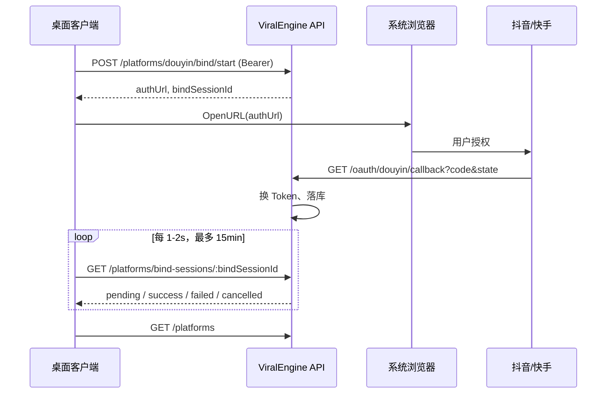

# 矩阵账号管理 API 接入文档

> 版本：v1  
> 基础路径：`{API_BASE}`，默认 `http://localhost:3000/api`  
> 在线文档（Swagger）：`http://localhost:3000/api/docs`（标签 **Platform Accounts** / **OAuth**）  
> OpenAPI JSON：`http://localhost:3000/api/docs-json`

---

## 1. 概述

矩阵账号管理 API 用于替代桌面端本地的 `accounts.json` / `tokens.json`，实现：

- 绑定账号按登录用户隔离（从 JWT 解析，**禁止**客户端传 `userId`）
- OAuth 密钥与平台 Token 仅存服务端，**不会**出现在任何 API 响应中
- 桌面端通过 HTTP 调用，OAuth 授权页仍由客户端打开系统浏览器

### 前置条件

客户端需先完成用户登录，取得 JWT：

| 步骤 | 接口 |
|------|------|
| 登录 | `POST /api/auth/login` |
| 或注册 | `POST /api/auth/register` |

登录成功响应中的 `accessToken` 用于后续所有矩阵账号接口。

---

## 2. 通用约定

### 2.1 请求头

除 OAuth 回调外，所有接口均需：

```http
Authorization: Bearer <accessToken>
Content-Type: application/json
```

Swagger 调试：点击 **Authorize**，填入 `Bearer <token>`（或仅 token，视 UI 而定）。

### 2.2 成功响应

直接返回 JSON 对象或数组，**不**额外包装 `{ data: ... }` 层。

### 2.3 错误响应

与 `/auth` 一致：

```json
{
  "statusCode": 400,
  "timestamp": "2026-05-25T08:00:00.000Z",
  "path": "/api/platforms/douyin/bind/start",
  "message": "该平台暂未开放绑定"
}
```

参数校验失败时，`message` 可能为字符串数组。

| HTTP | 常见场景 |
|------|----------|
| 400 | 业务错误（平台未开放、会话已结束、OAuth 未配置等） |
| 401 | 未登录或 Token 失效 |
| 403 | 操作他人的绑定会话 / 账号 |
| 404 | 账号或绑定会话不存在 |
| 409 | 重复绑定同一平台 openId |
| 422 | 请求体字段校验失败 |

### 2.4 TypeScript 类型（与前端对齐）

```typescript
type PlatformID =
  | 'douyin'
  | 'kuaishou'
  | 'bilibili'
  | 'xiaohongshu'
  | 'weixin_channels'
  | 'tiktok';

type BindStatus = 'unbound' | 'binding' | 'bound' | 'expired' | 'error';

type BindSessionStatus = 'pending' | 'success' | 'failed' | 'cancelled';

type ProxyType = 'none' | 'http' | 'socks5';

interface PlatformMeta {
  id: PlatformID;
  name: string;
  icon: string;
  description: string;
  enabled: boolean;
}

interface BoundAccount {
  id: string;
  platformId: PlatformID;
  platformName: string;
  nickname: string;
  avatarUrl: string;
  openId: string;        // 脱敏，如 7123****8901
  status: BindStatus;
  boundAt: string;       // ISO 8601
  expiresAt?: string;
  lastError?: string;
}

interface PlatformAccountView {
  platform: PlatformMeta;
  accounts?: BoundAccount[];
}
```

---

## 3. 接口列表

### 3.1 平台列表（含绑定状态）

用于账号管理页、创作中心、发布视频等。

**`GET /platforms`**

**响应 `200`**

```json
[
  {
    "platform": {
      "id": "douyin",
      "name": "抖音",
      "icon": "douyin",
      "description": "字节跳动 · 短视频",
      "enabled": true
    },
    "accounts": [
      {
        "id": "550e8400-e29b-41d4-a716-446655440000",
        "platformId": "douyin",
        "platformName": "抖音",
        "nickname": "示例昵称",
        "avatarUrl": "https://example.com/avatar.jpg",
        "openId": "7123****8901",
        "status": "bound",
        "boundAt": "2026-05-20T08:00:00.000Z",
        "expiresAt": "2026-06-20T08:00:00.000Z"
      }
    ]
  },
  {
    "platform": {
      "id": "kuaishou",
      "name": "快手",
      "icon": "kuaishou",
      "description": "快手 · 短视频",
      "enabled": true
    }
  }
]
```

**说明**

- 返回所有平台元数据；`accounts` 仅包含当前用户的绑定账号。
- 无绑定账号时，该项可能不含 `accounts` 字段。
- 进行中的 OAuth 绑定会插入占位账号：`status: "binding"`，`nickname: "等待浏览器授权…"`，此时 `id` 为 `bindSessionId`（非最终账号 ID）。
- 当前 **已开放 OAuth 绑定** 的平台：`douyin`、`kuaishou`（`enabled: true`）。其余平台 `enabled: false`，调用绑定接口会返回 400。

---

### 3.2 取消进行中绑定并刷新列表

等价桌面端 `RefreshPlatforms`：将当前用户所有 `pending` 绑定会话标为 `cancelled`，再返回与 `GET /platforms` 相同结构。

**`POST /platforms/refresh`**

**请求体**：无

**响应 `200`**：同 [3.1](#31-平台列表含绑定状态)

---

### 3.3 发起 OAuth 绑定

**`POST /platforms/:platformId/bind/start`**

| 路径参数 | 说明 |
|----------|------|
| platformId | `douyin` \| `kuaishou` |

**请求体**（可选）

```json
{
  "redirectAfter": "viralengine://oauth-done"
}
```

> 注：当前服务端尚未根据 `redirectAfter` 做 302 跳转，OAuth 回调固定返回 HTML 成功页。桌面端请使用轮询接口获取结果。

**响应 `200`**

```json
{
  "bindSessionId": "7c9e6679-7425-40de-944b-e07fc1f90ae7",
  "authUrl": "https://open.douyin.com/platform/oauth/connect/?client_key=...&state=...",
  "expiresIn": 900
}
```

| 字段 | 说明 |
|------|------|
| bindSessionId | 轮询绑定结果时使用 |
| authUrl | 用系统浏览器打开的授权地址 |
| expiresIn | 会话有效秒数（默认 900，即 15 分钟） |

**客户端动作**

1. 调用本接口
2. `OpenURL(authUrl)` 打开系统浏览器
3. 轮询 [3.5](#35-轮询绑定结果)（建议间隔 1–2 秒，最长 15 分钟）

---

### 3.4 OAuth 回调（服务端 / 浏览器）

**`GET /oauth/:platformId/callback`**

| 路径参数 | 说明 |
|----------|------|
| platformId | `douyin` \| `kuaishou` |

**Query 参数**：平台标准 OAuth 参数 `code`、`state`；失败时可能有 `error`、`error_description`。

**鉴权**：不需要 Bearer Token（浏览器跳转），通过 `state` 防伪。

**响应**：HTML 页面，提示「授权成功，可关闭此窗口」或失败原因。

> 此接口由开放平台回调触发，**桌面客户端无需直接调用**。客户端通过轮询 [3.5](#35-轮询绑定结果) 感知结果。

---

### 3.5 轮询绑定结果

**`GET /platforms/bind-sessions/:bindSessionId`**

**响应 `200` — 进行中**

```json
{
  "status": "pending",
  "account": null,
  "error": null
}
```

**响应 `200` — 成功**

```json
{
  "status": "success",
  "account": {
    "id": "550e8400-e29b-41d4-a716-446655440000",
    "platformId": "douyin",
    "platformName": "抖音",
    "nickname": "示例昵称",
    "avatarUrl": "https://example.com/avatar.jpg",
    "openId": "7123****8901",
    "status": "bound",
    "boundAt": "2026-05-20T08:00:00.000Z",
    "expiresAt": "2026-06-20T08:00:00.000Z"
  },
  "error": null
}
```

**响应 `200` — 失败**

```json
{
  "status": "failed",
  "account": null,
  "error": "授权已取消"
}
```

**响应 `200` — 已取消 / 超时**

```json
{
  "status": "cancelled",
  "account": null,
  "error": "绑定会话已超时"
}
```

| status | 客户端处理 |
|--------|------------|
| pending | 继续轮询 |
| success | 停止轮询，刷新平台列表；`account.id` 为正式矩阵账号 ID |
| failed | 停止轮询，展示 `error` |
| cancelled | 停止轮询（用户调用了 refresh 或会话过期） |

---

### 3.6 使用 authorization code 完成绑定（可选）

若短期仍保留桌面 `127.0.0.1` 本地回调，可将授权码交给 API 换 Token（secret 仍在服务端）。

**`POST /platforms/:platformId/bind/complete`**

**请求体**

```json
{
  "code": "授权码",
  "bindSessionId": "7c9e6679-7425-40de-944b-e07fc1f90ae7"
}
```

**响应 `200`**：`BoundAccount` 对象（同 3.5 success 中的 `account`）

**错误**

- 409：该 openId 已被当前用户绑定
- 400：会话已结束、平台不匹配、OAuth 换 Token 失败等

---

### 3.7 解绑

**`DELETE /platform-accounts/:accountId`**

**响应 `204`**：无 body

**说明**

- 服务端删除账号、Token、网络配置关联数据。
- 桌面端解绑后仍需本地清理 WebView：`ClearSession`、`RemoveProfile`（与 API 解绑并行调用）。

---

### 3.8 刷新平台 Token

发布前检查 Token 是否有效；**不返回** access_token。

**`POST /platform-accounts/:accountId/token/refresh`**

**响应 `200`**

```json
{
  "expiresAt": "2026-06-20T08:00:00.000Z"
}
```

**错误**

- 400：该账号无可刷新的 refresh_token
- 404：账号不存在或不属于当前用户

---

### 3.9 账号网络配置

与桌面端 `GetAccountNetwork` / `SetAccountNetwork` / `TestAccountNetwork` 对齐。

#### 获取配置

**`GET /platform-accounts/:accountId/network`**

**响应 `200`**

```json
{
  "accountId": "550e8400-e29b-41d4-a716-446655440000",
  "enabled": true,
  "proxyType": "http",
  "host": "proxy.example.com",
  "port": 8080,
  "username": "user",
  "password": "",
  "regionLabel": "广东-深圳",
  "lastIp": "1.2.3.4",
  "lastRegion": "CN-Guangdong",
  "lastCheckedAt": "2026-05-20T10:00:00.000Z"
}
```

> `GET` 响应中 **password 始终为空字符串**。更新时需改密码请显式传入。

未配置过网络时，返回默认值：`enabled: false`，`proxyType: "none"`，`password: ""`。

#### 更新配置

**`PUT /platform-accounts/:accountId/network`**

**请求体**（字段均可选，只更新传入的字段）

```json
{
  "enabled": true,
  "proxyType": "http",
  "host": "proxy.example.com",
  "port": 8080,
  "username": "user",
  "password": "secret",
  "regionLabel": "广东-深圳"
}
```

| 字段 | 说明 |
|------|------|
| password | 不传或传空字符串表示**不修改**已有密码 |
| proxyType | `none` \| `http` \| `socks5` |

**响应 `200`**：同 GET 结构（password 仍为空字符串）

#### 测试网络

**`POST /platform-accounts/:accountId/network/test`**

**请求体**：与 PUT 相同（可用未保存的草稿配置测试）

**响应 `200`**

```json
{
  "ip": "1.2.3.4",
  "country": "CN",
  "region": "Guangdong",
  "city": "Shenzhen",
  "isp": "China Telecom"
}
```

> **当前实现说明**：测试接口使用服务端公网 IP 检测（`ip-api.com`），**尚未**通过请求体中的代理配置发起真实代理连通性检测。若 `proxyType` 非 `none`，需填写 `host` 与 `port`，但实际探测仍走服务端出口 IP。后续版本将支持真实代理检测。

测试成功后会更新该账号已保存配置中的 `lastIp`、`lastRegion`、`lastCheckedAt`（若已有网络配置记录）。

---

## 4. 推荐绑定流程（桌面端）



### 伪代码示例

```typescript
const API_BASE = 'http://localhost:3000/api';

async function bindPlatform(platformId: 'douyin' | 'kuaishou', accessToken: string) {
  const headers = {
    Authorization: `Bearer ${accessToken}`,
    'Content-Type': 'application/json',
  };

  // 1. 发起绑定
  const startRes = await fetch(`${API_BASE}/platforms/${platformId}/bind/start`, {
    method: 'POST',
    headers,
    body: '{}',
  });
  if (!startRes.ok) throw new Error(await startRes.text());
  const { bindSessionId, authUrl, expiresIn } = await startRes.json();

  // 2. 打开浏览器（Wails: runtime.BrowserOpenURL）
  await openSystemBrowser(authUrl);

  // 3. 轮询
  const deadline = Date.now() + expiresIn * 1000;
  while (Date.now() < deadline) {
    await sleep(1500);
    const pollRes = await fetch(
      `${API_BASE}/platforms/bind-sessions/${bindSessionId}`,
      { headers },
    );
    const result = await pollRes.json();

    if (result.status === 'success') return result.account;
    if (result.status === 'failed' || result.status === 'cancelled') {
      throw new Error(result.error ?? '绑定失败');
    }
  }

  throw new Error('绑定超时');
}
```

---

## 5. 与桌面 Wails 方法映射

| Wails 方法 | 新 API |
|------------|--------|
| `ListPlatforms` | `GET /platforms` |
| `RefreshPlatforms` | `POST /platforms/refresh` |
| `StartPlatformBind` | `POST /platforms/:platformId/bind/start` |
| `CompletePlatformBind` | `POST /platforms/:platformId/bind/complete` |
| `BindPlatform` | `bind/start` + 打开浏览器 + 轮询 `bind-sessions/:id` |
| `UnbindPlatform` | `DELETE /platform-accounts/:accountId` |
| `GetAccountNetwork` | `GET /platform-accounts/:accountId/network` |
| `SetAccountNetwork` | `PUT /platform-accounts/:accountId/network` |
| `TestAccountNetwork` | `POST /platform-accounts/:accountId/network/test` |

---

## 6. 客户端注意事项

1. **不要本地存储平台 access_token / refresh_token**，发布、刷新一律走 API。
2. **`openId` 为脱敏值**，仅用于展示，不可作为业务主键；请使用 `account.id`（UUID）。
3. **绑定进行中**时列表里可能出现 `status: "binding"` 的占位项，其 `id` 是 `bindSessionId`；成功后请用轮询返回的 `account.id` 或重新拉列表。
4. **401 处理**：Token 过期时引导用户重新登录，再重试矩阵账号接口。
5. **409 重复绑定**：提示用户该账号已绑定，勿重复操作。
6. **OAuth 回调 URL** 由服务端配置（见服务端 `.env`），桌面端无需再监听 `127.0.0.1:58473`（若走推荐流程）。

---

## 7. 服务端环境（供联调参考）

客户端联调前，服务端需配置开放平台凭证（`.env`）：

```env
DOUYIN_CLIENT_KEY=
DOUYIN_CLIENT_SECRET=
DOUYIN_REDIRECT_URI=http://localhost:3000/api/oauth/douyin/callback

KUAISHOU_APP_ID=
KUAISHOU_APP_SECRET=
KUAISHOU_REDIRECT_URI=http://localhost:3000/api/oauth/kuaishou/callback
```

开放平台后台登记的回调 URL 必须与上述 `*_REDIRECT_URI` **完全一致**。

本地开发默认地址：`http://localhost:3000/api`  
Swagger：`http://localhost:3000/api/docs`
