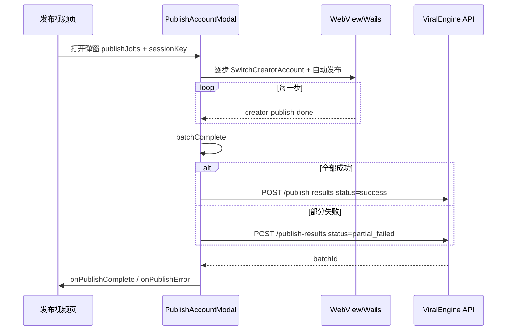

# 创作者中心发布结果 API 接入文档

> 版本：v1  
> 基础路径：`{API_BASE}`，默认 `http://localhost:3000/api`  
> 在线文档（Swagger）：`http://localhost:3000/api/docs`（标签 **Publish Results**）  
> OpenAPI JSON：`http://localhost:3000/api/docs-json`  
> 关联文档：[platform-accounts-api.md](./platform-accounts-api.md)

---

## 1. 概述

发布结果 API 用于在桌面端通过 **抖音创作者中心 WebView** 完成批量发布后，将批次汇总与每步明细落库，供「发布列表」页查询历史记录。

### 1.1 能力边界（v1）

| 能力 | v1 | 说明 |
|------|-----|------|
| 单步成功/失败判定 | ✅ | WebView DOM 检测（离开发布页 / 「发布成功」文案） |
| 平台作品 ID / 分享链接 | ❌ | 字段预留 `platformWorkId`、`platformWorkUrl` |
| 视频上传到业务 OSS | ❌ | 仅接受 `videoFileName`、`videoLocalPathHash`，**不上传明文路径** |
| 非抖音平台自动发布 | ❌ | 队列跳过非抖音账号，记录在 `skippedNonDouyinCount` |

### 1.2 前置条件

客户端需先完成用户登录，取得 JWT：

| 步骤 | 接口 |
|------|------|
| 登录 | `POST /api/auth/login` |
| 或注册 | `POST /api/auth/register` |

矩阵账号须已通过 [platform-accounts-api.md](./platform-accounts-api.md) 绑定；上报时 `items[].accountId` 须为当前用户已绑定的 `platform_accounts.id`。

### 1.3 触发时机

在 `PublishAccountModal` 批量队列全部结束后（`batchComplete === true`）调用 **一次** `POST /publish-results`。全部成功与部分失败均应上报。

---

## 2. 通用约定

### 2.1 请求头

```http
Authorization: Bearer <accessToken>
Content-Type: application/json
```

Swagger 调试：点击 **Authorize**，填入 `Bearer <token>`。

### 2.2 成功响应

直接返回 JSON 对象，**不**额外包装 `{ data: ... }` 层。

### 2.3 错误响应

```json
{
  "statusCode": 400,
  "timestamp": "2026-06-05T08:00:00.000Z",
  "path": "/api/publish-results",
  "message": "taskCount 与 items 长度不一致"
}
```

参数校验失败时，`message` 可能为字符串数组。

| HTTP | 常见场景 |
|------|----------|
| 400 | 计数不一致、`status` 与成功/失败数不匹配、`stepKey` 重复等 |
| 401 | 未登录或 Token 失效 |
| 403 | `accountId` 不属于当前用户 |
| 404 | 关联草稿不存在、批次详情不存在 |
| 409 | 同 `clientBatchId` 重复提交但 body 与已有记录不一致 |
| 422 | 请求体字段校验失败 |

### 2.4 TypeScript 类型

```typescript
type PublishBatchStatus = 'success' | 'partial_failed' | 'failed';
type PublishBatchItemStatus = 'success' | 'failed';

interface PublishCartItemSnapshot {
  title: string;
  link: string;
}

interface PublishLocationSnapshot {
  id: string;
  name: string;
  address: string;
}

interface SubmitPublishResultItem {
  stepKey: string;                    // `${entryClientId}:${accountId}`
  entryClientId: string;
  draftItemClientId?: string | null;
  accountId: string;                  // platform_accounts.id
  platformId: string;                 // v1 固定 'douyin'
  accountNickname: string;
  accountOpenId?: string | null;
  videoTitle: string;
  videoDescription?: string;
  topics?: string[];
  tags?: string[];
  videoFileName?: string | null;
  videoLocalPathHash?: string | null; // SHA-256，勿传明文路径
  douyinPublishTag?: string | null;   // 如 '购物车'
  douyinCartItems?: PublishCartItemSnapshot[];
  location?: PublishLocationSnapshot | null;
  scheduleAt?: string | null;         // ISO 8601
  status: PublishBatchItemStatus;
  errorCode?: string | null;
  errorMessage?: string | null;
  platformWorkId?: string | null;
  platformWorkUrl?: string | null;
  publishedAt: string;                // ISO 8601
}

interface SubmitPublishResultBody {
  clientBatchId?: string;             // 建议 UUID，幂等键
  publishSessionKey?: number;
  draftId?: string | null;
  status: PublishBatchStatus;
  platformScope: string;              // v1 传 'douyin'
  publishMethod: string;              // v1 传 'creator_center_webview'
  videoCount: number;
  taskCount: number;                  // 必须等于 items.length
  successCount: number;
  failureCount: number;
  skippedNonDouyinCount?: number;     // 默认 0
  startedAt: string;
  finishedAt: string;
  items: SubmitPublishResultItem[];
}
```

---

## 3. 接口列表

### 3.1 上报发布批次结果

批量发布队列全部结束后调用 **一次**。

**`POST /publish-results`**

#### 批次 `status` 规则

| 条件 | status |
|------|--------|
| `failureCount === 0` | `success` |
| `successCount === 0` | `failed` |
| 两者均 > 0 | `partial_failed` |

#### 请求体示例（完整）

```json
{
  "clientBatchId": "7c9e6679-7425-40de-944b-e07fc1f90ae7",
  "publishSessionKey": 3,
  "draftId": "550e8400-e29b-41d4-a716-446655440000",
  "status": "success",
  "platformScope": "douyin",
  "publishMethod": "creator_center_webview",
  "videoCount": 2,
  "taskCount": 3,
  "successCount": 3,
  "failureCount": 0,
  "skippedNonDouyinCount": 1,
  "startedAt": "2026-06-05T08:10:00.000Z",
  "finishedAt": "2026-06-05T08:18:42.000Z",
  "items": [
    {
      "stepKey": "pv-1749102000-abc123:aa11bb22-cc33-dd44-ee55-ff6677889900",
      "entryClientId": "pv-1749102000-abc123",
      "draftItemClientId": "pv-1749102000-abc123",
      "accountId": "aa11bb22-cc33-dd44-ee55-ff6677889900",
      "platformId": "douyin",
      "accountNickname": "阿拉腾日常优选",
      "accountOpenId": "7123456789012345678",
      "videoTitle": "草原好物开箱",
      "videoDescription": "今天给大家开箱牧区好物…",
      "topics": ["草原", "好物"],
      "tags": ["开箱", "日常"],
      "videoFileName": "grassland-unbox.mp4",
      "videoLocalPathHash": "e3b0c44298fc1c149afbf4c8996fb92427ae41e4649b934ca495991b7852b855",
      "douyinPublishTag": "购物车",
      "douyinCartItems": [
        { "title": "羊毛围巾", "link": "https://haohuo.jinritemai.com/..." }
      ],
      "location": {
        "id": "poi-001",
        "name": "三里屯太古里",
        "address": "北京市朝阳区…"
      },
      "scheduleAt": null,
      "status": "success",
      "errorCode": null,
      "errorMessage": null,
      "platformWorkId": null,
      "platformWorkUrl": null,
      "publishedAt": "2026-06-05T08:12:30.000Z"
    }
  ]
}
```

#### 最小请求示例（全部成功）

```json
{
  "clientBatchId": "7c9e6679-7425-40de-944b-e07fc1f90ae7",
  "status": "success",
  "platformScope": "douyin",
  "publishMethod": "creator_center_webview",
  "videoCount": 1,
  "taskCount": 2,
  "successCount": 2,
  "failureCount": 0,
  "startedAt": "2026-06-05T08:10:00.000Z",
  "finishedAt": "2026-06-05T08:18:42.000Z",
  "items": [
    {
      "stepKey": "pv-xxx:account-a",
      "entryClientId": "pv-xxx",
      "accountId": "account-a",
      "platformId": "douyin",
      "accountNickname": "账号A",
      "videoTitle": "标题",
      "status": "success",
      "publishedAt": "2026-06-05T08:12:00.000Z"
    },
    {
      "stepKey": "pv-xxx:account-b",
      "entryClientId": "pv-xxx",
      "accountId": "account-b",
      "platformId": "douyin",
      "accountNickname": "账号B",
      "videoTitle": "标题",
      "status": "success",
      "publishedAt": "2026-06-05T08:14:00.000Z"
    }
  ]
}
```

#### 请求字段说明

**批次级**

| 字段 | 类型 | 必填 | 说明 |
|------|------|------|------|
| clientBatchId | string (UUID) | 建议 | 客户端幂等键；同用户重复 POST 相同 id 且 body 一致时返回已有记录 |
| publishSessionKey | number | 否 | 前端 `publishSessionKey`，同页多次发布排查用 |
| draftId | string \| null | 否 | 关联草稿；须属于当前用户 |
| status | enum | 是 | `success` \| `partial_failed` \| `failed` |
| platformScope | string | 是 | v1 传 `douyin` |
| publishMethod | string | 是 | v1 传 `creator_center_webview` |
| videoCount | number | 是 | 去重视频数 |
| taskCount | number | 是 | 必须等于 `items.length` |
| successCount | number | 是 | 必须等于 `items` 中 `status=success` 的数量 |
| failureCount | number | 是 | 必须等于 `items` 中 `status=failed` 的数量 |
| skippedNonDouyinCount | number | 否 | 默认 0；被队列忽略的非抖音账号数 |
| startedAt | string | 是 | ISO 8601；建议取弹窗打开 / 队列开始时间 |
| finishedAt | string | 是 | ISO 8601；`batchComplete` 时刻 |
| items | array | 是 | 每一步一条 |

**明细级 `items[]`**

| 字段 | 类型 | 必填 | 说明 |
|------|------|------|------|
| stepKey | string | 是 | `${entryClientId}:${accountId}`，批次内唯一 |
| entryClientId | string | 是 | 发布页视频条目 ID |
| draftItemClientId | string \| null | 否 | 与草稿 `payload.items[].clientId` 对齐 |
| accountId | string (UUID) | 是 | `platform_accounts.id` |
| platformId | string | 是 | 如 `douyin` |
| accountNickname | string | 是 | 发布时刻昵称快照 |
| accountOpenId | string \| null | 否 | 平台 openId 快照 |
| videoTitle | string | 是 | 实际发布标题 |
| videoDescription | string | 否 | 实际发布简介正文 |
| topics | string[] | 否 | 话题数组 |
| tags | string[] | 否 | 业务标签（与话题不同） |
| videoFileName | string \| null | 否 | 本地视频文件名（不含完整路径） |
| videoLocalPathHash | string \| null | 否 | 本机绝对路径 SHA-256；**不要上传明文路径** |
| douyinPublishTag | string \| null | 否 | 如 `购物车` |
| douyinCartItems | array | 否 | 购物车快照 |
| location | object \| null | 否 | POI 快照 `{ id, name, address }` |
| scheduleAt | string \| null | 否 | 定时意图 ISO 8601 |
| status | enum | 是 | `success` \| `failed` |
| errorCode | string \| null | 失败时建议 | 归一化错误码，见 [4.2](#42-建议错误码映射) |
| errorMessage | string \| null | 失败时建议 | WebView 回传原文 |
| platformWorkId | string \| null | 否 | 预留 |
| platformWorkUrl | string \| null | 否 | 预留 |
| publishedAt | string | 是 | 收到 `creator-publish-done` 的时间 |

#### 响应 `201`（首次创建） / `200`（幂等命中）

```json
{
  "id": "b1c2d3e4-f5a6-7890-abcd-ef1234567890",
  "clientBatchId": "7c9e6679-7425-40de-944b-e07fc1f90ae7",
  "status": "success",
  "videoCount": 2,
  "taskCount": 3,
  "successCount": 3,
  "failureCount": 0,
  "skippedNonDouyinCount": 1,
  "draftId": "550e8400-e29b-41d4-a716-446655440000",
  "startedAt": "2026-06-05T08:10:00.000Z",
  "finishedAt": "2026-06-05T08:18:42.000Z",
  "createdAt": "2026-06-05T08:18:43.000Z",
  "items": [
    {
      "id": "c2d3e4f5-a6b7-8901-cdef-123456789012",
      "stepKey": "pv-1749102000-abc123:aa11bb22-cc33-dd44-ee55-ff6677889900",
      "status": "success",
      "accountId": "aa11bb22-cc33-dd44-ee55-ff6677889900",
      "accountNickname": "阿拉腾日常优选",
      "videoTitle": "草原好物开箱",
      "publishedAt": "2026-06-05T08:12:30.000Z"
    }
  ]
}
```

#### 服务端行为

1. 从 JWT 解析 `user_id`；校验 `draftId`、`items[].accountId` 归属当前用户。
2. 校验计数：`taskCount === items.length`，`successCount + failureCount === taskCount`，`status` 与计数一致。
3. 校验 `items` 内 `stepKey` 批次内唯一。
4. 若 `clientBatchId` 已存在且 body 一致 → 返回已有记录（`200`）；body 不一致 → `409`。
5. 写入 `publish_batches` + `publish_batch_items`。
6. 若 `draftId` 存在且 `status === success`，将草稿 `status` 更新为 `published`。

---

### 3.2 发布列表

供「发布列表」页使用。

**`GET /publish-results`**

#### Query 参数

| 参数 | 类型 | 默认 | 说明 |
|------|------|------|------|
| page | number | 1 | 页码，≥ 1 |
| pageSize | number | 20 | 每页条数，最大 50 |
| status | string | — | `success` \| `partial_failed` \| `failed` |
| accountId | string (UUID) | — | 筛选含该账号的批次 |
| keyword | string | — | 模糊匹配明细 `videoTitle` / `accountNickname` |
| from | string | — | `finishedAt` 起始 ISO 8601 |
| to | string | — | `finishedAt` 结束 ISO 8601 |

#### 响应 `200`

```json
{
  "items": [
    {
      "id": "b1c2d3e4-f5a6-7890-abcd-ef1234567890",
      "status": "success",
      "videoCount": 2,
      "taskCount": 3,
      "successCount": 3,
      "failureCount": 0,
      "finishedAt": "2026-06-05T08:18:42.000Z",
      "summaryTitle": "草原好物开箱 等 2 个视频",
      "accountsPreview": ["阿拉腾日常优选", "测试号2"]
    }
  ],
  "total": 48,
  "page": 1,
  "pageSize": 20
}
```

| 字段 | 说明 |
|------|------|
| summaryTitle | 首条成功明细标题；多视频时追加「等 N 个视频」 |
| accountsPreview | 批次内去重后的账号昵称列表 |

列表不返回完整明细，详情见 [3.3](#33-发布批次详情)。

---

### 3.3 发布批次详情

**`GET /publish-results/:batchId`**

| 路径参数 | 说明 |
|----------|------|
| batchId | 批次 UUID（`POST` 响应或列表项中的 `id`） |

#### 响应 `200`

```json
{
  "id": "b1c2d3e4-f5a6-7890-abcd-ef1234567890",
  "clientBatchId": "7c9e6679-7425-40de-944b-e07fc1f90ae7",
  "draftId": "550e8400-e29b-41d4-a716-446655440000",
  "status": "partial_failed",
  "platformScope": "douyin",
  "publishMethod": "creator_center_webview",
  "videoCount": 1,
  "taskCount": 2,
  "successCount": 1,
  "failureCount": 1,
  "skippedNonDouyinCount": 0,
  "startedAt": "2026-06-05T08:10:00.000Z",
  "finishedAt": "2026-06-05T08:15:00.000Z",
  "createdAt": "2026-06-05T08:15:01.000Z",
  "items": [
    {
      "id": "c2d3e4f5-a6b7-8901-cdef-123456789012",
      "stepKey": "pv-1:acc-1",
      "entryClientId": "pv-1",
      "draftItemClientId": "pv-1",
      "accountId": "acc-1",
      "platformId": "douyin",
      "accountNickname": "阿拉腾日常优选",
      "accountOpenId": "7123456789012345678",
      "videoTitle": "草原好物开箱",
      "videoDescription": "今天给大家开箱…",
      "topics": ["草原"],
      "tags": ["开箱"],
      "videoFileName": "grassland-unbox.mp4",
      "videoLocalPathHash": null,
      "douyinPublishTag": null,
      "douyinCartItems": null,
      "location": null,
      "scheduleAt": null,
      "status": "success",
      "errorCode": null,
      "errorMessage": null,
      "platformWorkId": null,
      "platformWorkUrl": null,
      "publishedAt": "2026-06-05T08:12:30.000Z"
    },
    {
      "id": "d3e4f5a6-b7c8-9012-def0-234567890123",
      "stepKey": "pv-1:acc-2",
      "entryClientId": "pv-1",
      "draftItemClientId": null,
      "accountId": "acc-2",
      "platformId": "douyin",
      "accountNickname": "测试号2",
      "accountOpenId": null,
      "videoTitle": "草原好物开箱",
      "videoDescription": "",
      "topics": null,
      "tags": null,
      "videoFileName": null,
      "videoLocalPathHash": null,
      "douyinPublishTag": null,
      "douyinCartItems": null,
      "location": null,
      "scheduleAt": null,
      "status": "failed",
      "errorCode": "PUBLISH_RESULT_TIMEOUT",
      "errorMessage": "等待发布结果超时",
      "platformWorkId": null,
      "platformWorkUrl": null,
      "publishedAt": "2026-06-05T08:14:50.000Z"
    }
  ]
}
```

**错误**

- 404：批次不存在或不属于当前用户

---

## 4. 前端字段映射

### 4.1 数据来源

| 上报字段 | 前端来源 | 备注 |
|----------|----------|------|
| clientBatchId | 弹窗打开时 `crypto.randomUUID()` | 建议新增 |
| publishSessionKey | `PublishVideoPage` state | 已有 |
| draftId | `entries[].draftId`（取首个非空） | 保存过草稿才有 |
| videoCount | `publishJobs.length` | 已有 |
| taskCount | `queueSteps.length` | 已有 |
| successCount / failureCount | 队列统计 | 已有 |
| skippedNonDouyinCount | `selectedAccountCount - totalSteps` | 已有 |
| startedAt | 弹窗 `open=true` 且队列开始时刻 | 建议新增 |
| finishedAt | `batchComplete` 变为 true 的时刻 | 建议新增 |
| items[].stepKey | `` `${entryId}:${accountId}` `` | 已有 |
| items[].entryClientId | `PublishJob.entryId` | 已有 |
| items[].accountId | 队列 step | 已有 |
| items[].videoTitle | `PublishJob.videoTitle` | 已有 |
| items[].videoDescription | `PublishJob.videoDescription` | 已有 |
| items[].topics | 解析 `videoDescriptionTagsJSON` | 已有 |
| items[].tags | `PublishVideoEntry.tags` | 需从发布页传入 modal |
| items[].videoFileName | `videoPath` basename | 客户端解析 |
| items[].douyinPublishTag | `PublishJob.douyinPublishTag` | 已有 |
| items[].douyinCartItems | 解析 `PublishJob.douyinCartJSON` | 已有 |
| items[].location | `entry.platformOverrides.douyin.location` | 需从发布页传入 |
| items[].scheduleAt | `entry.scheduleAt` | 需从发布页传入 |
| items[].status | `creator-publish-done.success` | 已有 |
| items[].errorMessage | `creator-publish-done.error` | 已有 |
| items[].publishedAt | 收到事件的时间戳 | 建议逐步记录 |

### 4.2 建议错误码映射

| errorMessage（WebView 原文） | errorCode |
|------------------------------|-----------|
| 等待发布结果超时 | `PUBLISH_RESULT_TIMEOUT` |
| 等待上传/发布超时 | `PUBLISH_PIPELINE_TIMEOUT` |
| 视频上传失败 | `VIDEO_UPLOAD_FAILED` |
| 登录超时，请重新登录该账号 | `CREATOR_LOGIN_EXPIRED` |
| 需要完成短信验证 | `SMS_VERIFICATION_REQUIRED` |
| 其他 | `PUBLISH_UNKNOWN` |

---

## 5. 推荐时序



### 伪代码示例

```typescript
const API_BASE = 'http://localhost:3000/api';

async function submitPublishResult(
  accessToken: string,
  body: SubmitPublishResultBody,
): Promise<{ id: string; status: string }> {
  const res = await fetch(`${API_BASE}/publish-results`, {
    method: 'POST',
    headers: {
      Authorization: `Bearer ${accessToken}`,
      'Content-Type': 'application/json',
    },
    body: JSON.stringify(body),
  });

  if (!res.ok) {
    const err = await res.json().catch(() => ({}));
    throw new Error(err.message ?? `HTTP ${res.status}`);
  }

  return res.json();
}

async function fetchPublishResults(
  accessToken: string,
  params: { page?: number; pageSize?: number; status?: string; keyword?: string },
) {
  const qs = new URLSearchParams(
    Object.entries(params)
      .filter(([, v]) => v != null)
      .map(([k, v]) => [k, String(v)]),
  );

  const res = await fetch(`${API_BASE}/publish-results?${qs}`, {
    headers: { Authorization: `Bearer ${accessToken}` },
  });

  if (!res.ok) throw new Error(await res.text());
  return res.json();
}

async function fetchPublishResultDetail(accessToken: string, batchId: string) {
  const res = await fetch(`${API_BASE}/publish-results/${batchId}`, {
    headers: { Authorization: `Bearer ${accessToken}` },
  });

  if (!res.ok) throw new Error(await res.text());
  return res.json();
}
```

---

## 6. 与前端模块映射（建议）

| 前端方法（建议） | API |
|------------------|-----|
| `submitPublishResult(body)` | `POST /publish-results` |
| `fetchPublishResults(params)` | `GET /publish-results` |
| `fetchPublishResult(batchId)` | `GET /publish-results/:batchId` |
| `PublishListPage` 列表 | `fetchPublishResults` |
| `PublishAccountModal.notifyBatchFinished` | 组装 body 并调用 `submitPublishResult` |

建议类型文件：`frontend/src/types/publishResult.ts`  
建议 API 文件：`frontend/src/api/publishResult.ts`

---

## 7. 客户端注意事项

1. **每次批量发布只调用一次** `POST /publish-results`；成功与部分失败都应上报。
2. **务必传 `clientBatchId`**（UUID），网络重试时依赖幂等，避免重复落库。
3. **不要上传 `videoLocalPath` 明文**；可选传 `videoFileName` 与 `videoLocalPathHash`（SHA-256）。
4. **`accountId` 必须使用矩阵账号 UUID**（`GET /platforms` 返回的 `account.id`），不要用 openId。
5. **上报失败时**（API 4xx/5xx）：本地队列已结束，应 toast「结果同步失败，可稍后重试」，并保留 payload 供重试（相同 `clientBatchId` 重 POST 即可）。
6. **401 处理**：Token 过期时引导重新登录后再上报。
7. **`platformWorkId` / `platformWorkUrl`** 当前 v1 传 `null` 即可，后续版本支持回写。

---

## 8. 服务端部署（供联调参考）

新表需执行数据库迁移：

```bash
npm run migration:run
```

迁移文件：`src/database/migrations/1749120000000-CreatePublishResultTables.ts`

本地开发默认地址：`http://localhost:3000/api`  
Swagger：`http://localhost:3000/api/docs`（标签 **Publish Results**）
