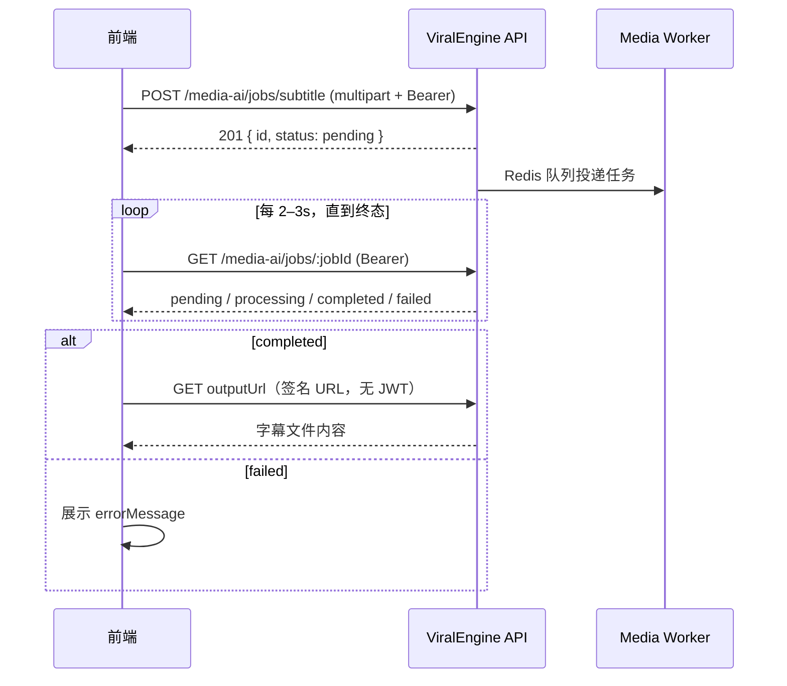

# 视频字幕识别 API 接入文档

> 版本：v1  
> 基础路径：`{API_BASE}`，默认 `http://localhost:3000/api`  
> 在线文档（Swagger）：`http://localhost:3000/api/docs`（标签 **Media AI**）  
> OpenAPI JSON：`http://localhost:3000/api/docs-json`

---

## 1. 概述

视频字幕识别 API 用于对上传的视频进行语音转文字，异步生成 **SRT** 或 **WebVTT** 字幕文件。

### 能力说明

| 项目 | 说明 |
|------|------|
| 识别引擎 | 服务端 Whisper（`faster-whisper`） |
| 语言 | 可指定语言代码（如 `zh`、`en`）；**留空则自动检测** |
| 输出格式 | `srt`（默认）或 `vtt` |
| 处理方式 | 异步任务：创建后立即返回任务 ID，需轮询状态 |
| 用户隔离 | 任务归属当前登录用户，**禁止**客户端传 `userId` |

### 前置条件

客户端需先完成用户登录，取得 JWT：

| 步骤 | 接口 |
|------|------|
| 登录 | `POST /api/auth/login` |
| 或注册 | `POST /api/auth/register` |

登录成功响应中的 `accessToken` 用于后续所有字幕识别接口。

服务端还需运行 **Media Worker**（Python）处理队列任务，否则任务会长期停留在 `pending` 状态。联调参考 [§7 服务端环境](#7-服务端环境供联调参考)。

---

## 2. 通用约定

### 2.1 请求头

| 接口 | Authorization | Content-Type |
|------|---------------|--------------|
| 创建字幕任务 | `Bearer <accessToken>` | `multipart/form-data` |
| 查询任务状态 | `Bearer <accessToken>` | 无（GET） |
| 删除任务 | `Bearer <accessToken>` | 无（DELETE） |
| 下载字幕文件（签名 URL） | **不需要** JWT | 无（GET） |

Swagger 调试：点击 **Authorize**，填入 `Bearer <token>`。

### 2.2 成功响应

直接返回 JSON 对象，**不**额外包装 `{ data: ... }` 层。

### 2.3 错误响应

```json
{
  "statusCode": 400,
  "timestamp": "2026-05-25T08:00:00.000Z",
  "path": "/api/media-ai/jobs/subtitle",
  "message": "请上传视频文件"
}
```

参数校验失败时，`message` 可能为字符串数组。

| HTTP | 常见场景 |
|------|----------|
| 400 | 未上传文件、视频格式不支持 |
| 401 | 未登录或 Token 失效 |
| 404 | 任务不存在或不属于当前用户 |
| 422 | 表单字段校验失败（如 `format` 非法） |

### 2.4 TypeScript 类型（与前端对齐）

```typescript
type MediaJobType = 'subtitle' | 'watermark' | 'text2image';

type MediaJobStatus = 'pending' | 'processing' | 'completed' | 'failed';

type SubtitleFormat = 'srt' | 'vtt';

interface MediaJobResponse {
  id: string;
  type: MediaJobType;
  status: MediaJobStatus;
  /** 0–100，处理中为 10，完成后为 100 */
  progress: number;
  /** 上传视频的签名下载地址（创建成功后即有） */
  inputUrl?: string;
  /** 字幕文件的签名下载地址（仅 status=completed 时有意义） */
  outputUrl?: string;
  /** 失败原因（仅 status=failed 时有值） */
  errorMessage?: string;
  createdAt: string;   // ISO 8601
  updatedAt: string;
  startedAt?: string;
  completedAt?: string;
}

interface CreateSubtitleJobForm {
  /** 视频文件，字段名必须为 file */
  file: File;
  /** 可选，Whisper 语言代码，如 zh / en / ja；留空自动检测 */
  language?: string;
  /** 可选，默认 srt */
  format?: SubtitleFormat;
}
```

---

## 3. 接口列表

### 3.1 创建字幕识别任务

**`POST /media-ai/jobs/subtitle`**

上传视频并创建异步字幕识别任务。

#### 请求

`Content-Type: multipart/form-data`

| 字段 | 类型 | 必填 | 说明 |
|------|------|------|------|
| `file` | File | 是 | 视频文件，表单字段名**必须为** `file` |
| `language` | string | 否 | 语言代码，留空自动检测。示例：`zh`、`en`、`ja` |
| `format` | string | 否 | 输出格式：`srt` \| `vtt`，默认 `srt` |

#### 支持的视频 MIME 类型

| MIME | 常见扩展名 |
|------|------------|
| `video/mp4` | `.mp4` |
| `video/quicktime` | `.mov` |
| `video/webm` | `.webm` |
| `video/x-msvideo` | `.avi` |

> 服务端按 MIME 校验，请确保浏览器 / 客户端上传时携带正确的 `Content-Type`。

#### 响应 `201`

```json
{
  "id": "a1b2c3d4-e5f6-7890-abcd-ef1234567890",
  "type": "subtitle",
  "status": "pending",
  "progress": 0,
  "inputUrl": "http://localhost:3000/api/media-ai/assets/content?key=...&expires=...&sig=...",
  "outputUrl": "http://localhost:3000/api/media-ai/assets/content?key=...&expires=...&sig=...",
  "createdAt": "2026-05-25T08:00:00.000Z",
  "updatedAt": "2026-05-25T08:00:00.000Z"
}
```

| 字段 | 说明 |
|------|------|
| `id` | 任务 UUID，用于后续轮询 |
| `status` | 初始为 `pending` |
| `inputUrl` | 已上传视频的临时签名 URL |
| `outputUrl` | 字幕文件占位路径的签名 URL；**任务完成前下载可能 404** |

#### 错误示例

| message | 原因 |
|---------|------|
| `请上传视频文件` | 未传 `file` 或文件为空 |
| `不支持的视频格式` | MIME 不在白名单内 |

#### cURL 示例

```bash
curl -X POST "http://localhost:3000/api/media-ai/jobs/subtitle" \
  -H "Authorization: Bearer <accessToken>" \
  -F "file=@/path/to/video.mp4" \
  -F "language=zh" \
  -F "format=srt"
```

---

### 3.2 查询任务状态

**`GET /media-ai/jobs/:jobId`**

轮询字幕识别进度，任务完成后获取字幕下载地址。

#### 路径参数

| 参数 | 说明 |
|------|------|
| `jobId` | 创建任务时返回的 `id` |

#### 响应 `200`

处理中：

```json
{
  "id": "a1b2c3d4-e5f6-7890-abcd-ef1234567890",
  "type": "subtitle",
  "status": "processing",
  "progress": 10,
  "inputUrl": "http://localhost:3000/api/media-ai/assets/content?key=...&expires=...&sig=...",
  "outputUrl": "http://localhost:3000/api/media-ai/assets/content?key=...&expires=...&sig=...",
  "createdAt": "2026-05-25T08:00:00.000Z",
  "updatedAt": "2026-05-25T08:00:05.000Z",
  "startedAt": "2026-05-25T08:00:03.000Z"
}
```

成功：

```json
{
  "id": "a1b2c3d4-e5f6-7890-abcd-ef1234567890",
  "type": "subtitle",
  "status": "completed",
  "progress": 100,
  "inputUrl": "http://localhost:3000/api/media-ai/assets/content?key=...&expires=...&sig=...",
  "outputUrl": "http://localhost:3000/api/media-ai/assets/content?key=...&expires=...&sig=...",
  "createdAt": "2026-05-25T08:00:00.000Z",
  "updatedAt": "2026-05-25T08:01:30.000Z",
  "startedAt": "2026-05-25T08:00:03.000Z",
  "completedAt": "2026-05-25T08:01:30.000Z"
}
```

失败：

```json
{
  "id": "a1b2c3d4-e5f6-7890-abcd-ef1234567890",
  "type": "subtitle",
  "status": "failed",
  "progress": 10,
  "inputUrl": "http://localhost:3000/api/media-ai/assets/content?key=...&expires=...&sig=...",
  "outputUrl": "http://localhost:3000/api/media-ai/assets/content?key=...&expires=...&sig=...",
  "errorMessage": "ffmpeg 音频提取失败",
  "createdAt": "2026-05-25T08:00:00.000Z",
  "updatedAt": "2026-05-25T08:00:20.000Z",
  "startedAt": "2026-05-25T08:00:03.000Z",
  "completedAt": "2026-05-25T08:00:20.000Z"
}
```

#### 任务状态流转

```
pending → processing → completed
                    ↘ failed
```

| status | 含义 | 前端建议 |
|--------|------|----------|
| `pending` | 已入队，等待 Worker 消费 | 继续轮询 |
| `processing` | Worker 正在识别 | 继续轮询，可展示「识别中」 |
| `completed` | 识别成功 | 使用 `outputUrl` 下载字幕 |
| `failed` | 识别失败 | 展示 `errorMessage`，允许用户重试 |

> 当前实现中，进入 `processing` 后 `progress` 固定为 `10`，完成后为 `100`，**无中间进度**。前端可按状态展示 indeterminate 进度条。

---

### 3.3 下载字幕文件（签名 URL）

**`GET /media-ai/assets/content?key=&expires=&sig=`**

由 `outputUrl` 直接提供完整 URL，**无需 JWT**。

#### 用法

任务 `status === 'completed'` 后：

```typescript
const res = await fetch(job.outputUrl);
const subtitleText = await res.text(); // UTF-8 编码的 .srt / .vtt 内容
```

或在浏览器中 `<a href={job.outputUrl} download="subtitles.srt">` 触发下载。

#### 签名 URL 说明

| 参数 | 说明 |
|------|------|
| `key` | 存储路径（服务端内部 key） |
| `expires` | Unix 秒级过期时间 |
| `sig` | HMAC 签名 |

- 默认有效期 **3600 秒**（1 小时），由服务端 `STORAGE_SIGNED_URL_TTL` 控制
- **每次调用** `GET /media-ai/jobs/:jobId` 都会重新生成签名 URL（过期时间刷新）
- 签名过期后需重新查询任务接口获取新的 `outputUrl`

---

### 3.4 删除任务（释放存储）

**`DELETE /media-ai/jobs/:jobId`**

前端下载并保存字幕后调用，**立即删除**该任务在服务端的所有文件并移除任务记录。

#### 响应

- `204 No Content`：删除成功
- `404`：任务不存在或不属于当前用户

#### 推荐前端流程

```typescript
const subtitleText = await fetch(job.outputUrl).then((r) => r.text());
// 保存到业务侧后…
await fetch(`${API_BASE}/media-ai/jobs/${job.id}`, {
  method: 'DELETE',
  headers: { Authorization: `Bearer ${token}` },
});
```

> 若不调用 DELETE，产出文件在任务 `completed` 后默认保留 **12 小时**（`MEDIA_JOB_OUTPUT_RETENTION_HOURS`），由服务端定时清理；届时 `outputUrl` 将不可用（下载 404）。

---

### 3.5 文件存储生命周期

| 资源 | 何时删除 |
|------|----------|
| 上传的原视频（`input`） | 任务进入 `completed` 或 `failed` 后**立即**删除 |
| 字幕文件（`output`） | 前端 `DELETE` 任务时立即删除；或未删除时，`completedAt` 起 **12 小时**后自动清理 |
| 任务记录 | 仅 `DELETE` 时移除；自动清理只删文件，保留任务元数据（`outputUrl` 不再返回） |

---

## 4. 字幕输出格式

### 4.1 SRT（默认）

```srt
1
00:00:00,000 --> 00:00:02,500
大家好，欢迎收看本期视频

2
00:00:02,500 --> 00:00:05,800
今天我们来介绍字幕识别功能
```

- 时间戳格式：`HH:MM:SS,mmm`
- 编码：UTF-8
- 空片段（无语音段）会被跳过

### 4.2 WebVTT

```vtt
WEBVTT

00:00:00.000 --> 00:00:02.500
大家好，欢迎收看本期视频

00:00:02.500 --> 00:00:05.800
今天我们来介绍字幕识别功能
```

- 时间戳格式：`HH:MM:SS.mmm`
- 编码：UTF-8

---

## 5. 推荐接入流程



### 伪代码示例

```typescript
const API_BASE = 'http://localhost:3000/api';

async function recognizeSubtitles(
  accessToken: string,
  videoFile: File,
  options?: { language?: string; format?: 'srt' | 'vtt' },
): Promise<{ jobId: string; subtitleText: string }> {
  const headers = { Authorization: `Bearer ${accessToken}` };

  // 1. 创建任务
  const form = new FormData();
  form.append('file', videoFile);
  if (options?.language) form.append('language', options.language);
  if (options?.format) form.append('format', options.format);

  const createRes = await fetch(`${API_BASE}/media-ai/jobs/subtitle`, {
    method: 'POST',
    headers,
    body: form,
  });
  if (!createRes.ok) throw new Error(await createRes.text());
  const job = await createRes.json();

  // 2. 轮询（建议 2–3s 间隔，设置超时如 30min）
  const deadline = Date.now() + 30 * 60 * 1000;
  while (Date.now() < deadline) {
    await sleep(2500);

    const pollRes = await fetch(`${API_BASE}/media-ai/jobs/${job.id}`, { headers });
    if (!pollRes.ok) throw new Error(await pollRes.text());
    const current = await pollRes.json();

    if (current.status === 'completed') {
      const subRes = await fetch(current.outputUrl);
      if (!subRes.ok) throw new Error('字幕下载失败');
      const subtitleText = await subRes.text();
      return { jobId: current.id, subtitleText };
    }

    if (current.status === 'failed') {
      throw new Error(current.errorMessage ?? '字幕识别失败');
    }
  }

  throw new Error('字幕识别超时');
}

function sleep(ms: number) {
  return new Promise((resolve) => setTimeout(resolve, ms));
}
```

### React 上传组件要点

```typescript
// 使用原生 FormData，不要手动设置 Content-Type（浏览器会自动带 boundary）
const formData = new FormData();
formData.append('file', file); // input[type=file] 的 File 对象

await fetch(`${API_BASE}/media-ai/jobs/subtitle`, {
  method: 'POST',
  headers: { Authorization: `Bearer ${token}` },
  body: formData,
});
```

---

## 6. 客户端注意事项

1. **异步模型**：创建接口不会同步返回字幕内容，必须轮询 `GET /media-ai/jobs/:jobId`。
2. **仅查询自己的任务**：`jobId` 必须来自当前用户创建的任务，否则返回 `404`。
3. **outputUrl 时机**：仅在 `status === 'completed'` 后下载；提前下载可能得到 404。
4. **签名 URL 过期**：若下载失败且距上次查询超过 1 小时，重新调用查询接口刷新 URL。
5. **401 处理**：Token 过期时引导用户重新登录后再创建/查询任务。
6. **大文件**：当前 Media AI 上传**无单独大小限制**（与发布草稿不同）；超大视频会导致识别耗时显著增加，前端建议做文件大小提示与超时处理。
7. **语言参数**：传 Whisper 支持的 ISO 639-1 代码；传空字符串与不传等效，均为自动检测。
8. **Worker 依赖**：本地/测试环境需同时启动 API 与 Media Worker，否则任务不会推进。
9. **存储清理**：识别完成后原视频会自动删除；字幕默认保留 12 小时，**建议**下载成功后调用 `DELETE /media-ai/jobs/:jobId` 立即释放。
10. **完成后无 inputUrl**：任务结束并删除原视频后，查询接口不再返回 `inputUrl`。

---

## 7. 服务端环境（供联调参考）

```env
# 本地存储（与发布草稿共用）
STORAGE_LOCAL_PATH=storage
STORAGE_SIGNED_URL_TTL=3600
# STORAGE_SIGNED_URL_SECRET=   # 生产环境务必设置

# Media Worker
MEDIA_AI_QUEUE_KEY=media-ai:jobs
MEDIA_WORKER_SECRET=change-me-media-worker-secret
MEDIA_JOB_OUTPUT_RETENTION_HOURS=12

# Whisper 模型（国内网络在 media-worker/.env 配置 HF_ENDPOINT，无需翻墙）
HF_ENDPOINT=https://hf-mirror.com
```

### 7.1 Whisper 模型预下载（首次部署必做）

字幕识别依赖 `faster-whisper`，**首次使用前**需下载模型（约几百 MB）。国内直连 `huggingface.co` 易超时，请使用镜像：

```bash
cd media-worker
# 确保项目根 .env 已配置 HF_ENDPOINT=https://hf-mirror.com
python scripts/download_whisper_model.py small
```

下载成功后终端会打印模型路径。可选写入 `.env` 加速启动、离线运行：

```env
WHISPER_MODEL_PATH=C:/Users/你/.cache/huggingface/hub/models--Systran--faster-whisper-small/snapshots/xxxx
WHISPER_LOCAL_ONLY=true
```

| 变量 | 说明 |
|------|------|
| `HF_ENDPOINT` | 国内推荐 `https://hf-mirror.com`，**不需要翻墙** |
| `WHISPER_MODEL` | 模型尺寸，默认 `small`（速度与精度平衡） |
| `WHISPER_MODEL_PATH` | 本地已下载模型目录，优先于 `WHISPER_MODEL` |
| `WHISPER_LOCAL_ONLY` | `true` 时仅使用本地缓存，禁止联网 |

启动顺序建议：

1. MySQL、Redis
2. 预下载 Whisper 模型（见上文）
3. NestJS API：`npm run start:dev`
4. Media Worker：`cd media-worker && uvicorn app.main:app --reload --port 8000`

本地默认地址：

- API：`http://localhost:3000/api`
- Swagger：`http://localhost:3000/api/docs`

---

## 8. 接口速查

| 方法 | 路径 | 认证 | 说明 |
|------|------|------|------|
| `POST` | `/media-ai/jobs/subtitle` | Bearer | 上传视频，创建字幕识别任务 |
| `GET` | `/media-ai/jobs/:jobId` | Bearer | 查询任务状态与下载地址 |
| `DELETE` | `/media-ai/jobs/:jobId` | Bearer | 删除任务及文件（建议下载字幕后调用） |
| `GET` | `/media-ai/assets/content?...` | 签名 | 下载字幕文件（由 `outputUrl` 提供） |
