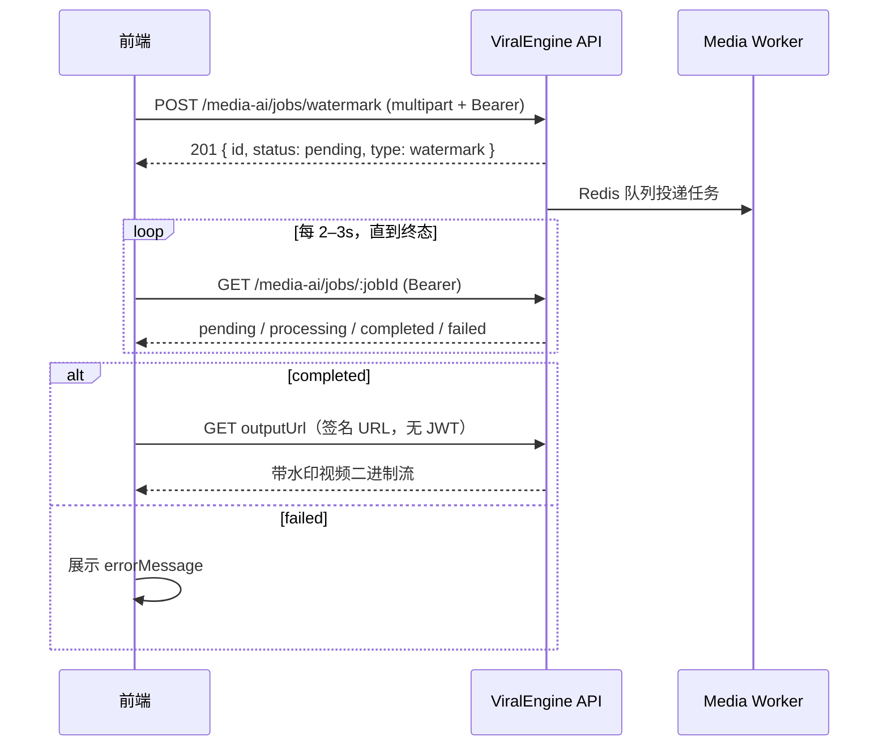

# 视频加水印 API 接入文档

> 版本：v1  
> 基础路径：`{API_BASE}`，默认 `http://localhost:3000/api`  
> 在线文档（Swagger）：`http://localhost:3000/api/docs`（标签 **Media AI**）  
> OpenAPI JSON：`http://localhost:3000/api/docs-json`

---

## 1. 概述

视频加水印 API 用于对上传的视频叠加**文字水印**，异步输出带水印的视频文件。输出格式与输入视频扩展名一致（如上传 `.mp4` 则输出 `.mp4`）。

### 能力说明

| 项目 | 说明 |
|------|------|
| 处理引擎 | 服务端 ffmpeg `drawtext` 滤镜 |
| 水印类型 | 文字水印（单行） |
| 水印位置 | 左上 / 右上 / 左下 / 右下 / 居中，默认右下 |
| 字体大小 | 可配置，默认 `24`（像素） |
| 水印样式 | 白色文字 + 半透明黑底描边框（服务端固定） |
| 音视频 | 视频重新编码；**音频流直接复制**（`copy`），不重新编码 |
| 处理方式 | 异步任务：创建后立即返回任务 ID，需轮询状态 |
| 用户隔离 | 任务归属当前登录用户，**禁止**客户端传 `userId` |

### 前置条件

客户端需先完成用户登录，取得 JWT：

| 步骤 | 接口 |
|------|------|
| 登录 | `POST /api/auth/login` |
| 或注册 | `POST /api/auth/register` |

登录成功响应中的 `accessToken` 用于后续所有加水印接口。

服务端还需运行 **Media Worker**（Python）处理队列任务，否则任务会长期停留在 `pending` 状态。联调参考 [§7 服务端环境](#7-服务端环境供联调参考)。

---

## 2. 通用约定

### 2.1 请求头

| 接口 | Authorization | Content-Type |
|------|---------------|--------------|
| 创建加水印任务 | `Bearer <accessToken>` | `multipart/form-data` |
| 查询任务状态 | `Bearer <accessToken>` | 无（GET） |
| 删除任务 | `Bearer <accessToken>` | 无（DELETE） |
| 下载成品视频（签名 URL） | **不需要** JWT | 无（GET） |

Swagger 调试：点击 **Authorize**，填入 `Bearer <token>`。

### 2.2 成功响应

直接返回 JSON 对象，**不**额外包装 `{ data: ... }` 层。

### 2.3 错误响应

```json
{
  "statusCode": 400,
  "timestamp": "2026-05-26T08:00:00.000Z",
  "path": "/api/media-ai/jobs/watermark",
  "message": "请上传视频文件"
}
```

参数校验失败时，`message` 可能为字符串数组。

| HTTP | 常见场景 |
|------|----------|
| 400 | 未上传文件、视频格式不支持 |
| 401 | 未登录或 Token 失效 |
| 404 | 任务不存在或不属于当前用户 |
| 422 | 表单字段校验失败（如 `text` 为空、`position` 非法） |

### 2.4 TypeScript 类型（与前端对齐）

```typescript
type MediaJobType = 'subtitle' | 'watermark' | 'text2image';

type MediaJobStatus = 'pending' | 'processing' | 'completed' | 'failed';

type WatermarkPosition =
  | 'top-left'
  | 'top-right'
  | 'bottom-left'
  | 'bottom-right'
  | 'center';

interface MediaJobResponse {
  id: string;
  type: MediaJobType;
  status: MediaJobStatus;
  /** 0–100，处理中为 10，完成后为 100 */
  progress: number;
  /** 原始视频的签名下载地址（创建成功后即有） */
  inputUrl?: string;
  /** 带水印视频的签名下载地址（仅 status=completed 时有意义） */
  outputUrl?: string;
  /** 失败原因（仅 status=failed 时有值） */
  errorMessage?: string;
  createdAt: string;   // ISO 8601
  updatedAt: string;
  startedAt?: string;
  completedAt?: string;
}

interface CreateWatermarkJobForm {
  /** 视频文件，字段名必须为 file */
  file: File;
  /** 水印文字，必填，最长 128 字符 */
  text: string;
  /** 可选，默认 bottom-right */
  position?: WatermarkPosition;
  /** 可选，字体大小（像素），默认 24 */
  fontSize?: number;
}
```

---

## 3. 接口列表

### 3.1 创建视频加水印任务

**`POST /media-ai/jobs/watermark`**

上传视频并创建异步加水印任务。

#### 请求

`Content-Type: multipart/form-data`

| 字段 | 类型 | 必填 | 说明 |
|------|------|------|------|
| `file` | File | 是 | 视频文件，表单字段名**必须为** `file` |
| `text` | string | 是 | 水印文字，最长 **128** 字符 |
| `position` | string | 否 | 水印位置，见下表，默认 `bottom-right` |
| `fontSize` | number | 否 | 字体大小（像素），默认 `24` |

#### 水印位置 `position` 枚举

| 值 | 说明 |
|----|------|
| `top-left` | 左上角 |
| `top-right` | 右上角 |
| `bottom-left` | 左下角 |
| `bottom-right` | 右下角（默认） |
| `center` | 居中 |

#### 支持的视频 MIME 类型

| MIME | 常见扩展名 |
|------|------------|
| `video/mp4` | `.mp4` |
| `video/quicktime` | `.mov` |
| `video/webm` | `.webm` |
| `video/x-msvideo` | `.avi` |

> 服务端按 MIME 校验，请确保浏览器 / 客户端上传时携带正确的 `Content-Type`。

#### 响应 `201`

```json
{
  "id": "a1b2c3d4-e5f6-7890-abcd-ef1234567890",
  "type": "watermark",
  "status": "pending",
  "progress": 0,
  "inputUrl": "http://localhost:3000/api/media-ai/assets/content?key=...&expires=...&sig=...",
  "outputUrl": "http://localhost:3000/api/media-ai/assets/content?key=...&expires=...&sig=...",
  "createdAt": "2026-05-26T08:00:00.000Z",
  "updatedAt": "2026-05-26T08:00:00.000Z"
}
```

| 字段 | 说明 |
|------|------|
| `id` | 任务 UUID，用于后续轮询 |
| `type` | 固定为 `watermark` |
| `status` | 初始为 `pending` |
| `inputUrl` | 已上传原视频的临时签名 URL |
| `outputUrl` | 成品视频占位路径的签名 URL；**任务完成前下载可能 404** |

#### 错误示例

| message | 原因 |
|---------|------|
| `请上传视频文件` | 未传 `file` 或文件为空 |
| `不支持的视频格式` | MIME 不在白名单内 |
| `text must be shorter than or equal to 128 characters` | 水印文字超长（422） |
| `position must be one of the following values: ...` | `position` 不在枚举内（422） |

#### cURL 示例

```bash
curl -X POST "http://localhost:3000/api/media-ai/jobs/watermark" \
  -H "Authorization: Bearer <accessToken>" \
  -F "file=@/path/to/video.mp4" \
  -F "text=© ViralEngine" \
  -F "position=bottom-right" \
  -F "fontSize=28"
```

---

### 3.2 查询任务状态

**`GET /media-ai/jobs/:jobId`**

轮询加水印进度，任务完成后获取成品视频下载地址。

> 与字幕识别、文生图等任务**共用**同一查询接口；通过响应中的 `type` 字段区分任务类型。

#### 路径参数

| 参数 | 说明 |
|------|------|
| `jobId` | 创建任务时返回的 `id` |

#### 响应 `200`

处理中：

```json
{
  "id": "a1b2c3d4-e5f6-7890-abcd-ef1234567890",
  "type": "watermark",
  "status": "processing",
  "progress": 10,
  "inputUrl": "http://localhost:3000/api/media-ai/assets/content?key=...&expires=...&sig=...",
  "outputUrl": "http://localhost:3000/api/media-ai/assets/content?key=...&expires=...&sig=...",
  "createdAt": "2026-05-26T08:00:00.000Z",
  "updatedAt": "2026-05-26T08:00:05.000Z",
  "startedAt": "2026-05-26T08:00:03.000Z"
}
```

成功：

```json
{
  "id": "a1b2c3d4-e5f6-7890-abcd-ef1234567890",
  "type": "watermark",
  "status": "completed",
  "progress": 100,
  "inputUrl": "http://localhost:3000/api/media-ai/assets/content?key=...&expires=...&sig=...",
  "outputUrl": "http://localhost:3000/api/media-ai/assets/content?key=...&expires=...&sig=...",
  "createdAt": "2026-05-26T08:00:00.000Z",
  "updatedAt": "2026-05-26T08:00:45.000Z",
  "startedAt": "2026-05-26T08:00:03.000Z",
  "completedAt": "2026-05-26T08:00:45.000Z"
}
```

失败：

```json
{
  "id": "a1b2c3d4-e5f6-7890-abcd-ef1234567890",
  "type": "watermark",
  "status": "failed",
  "progress": 10,
  "inputUrl": "http://localhost:3000/api/media-ai/assets/content?key=...&expires=...&sig=...",
  "outputUrl": "http://localhost:3000/api/media-ai/assets/content?key=...&expires=...&sig=...",
  "errorMessage": "ffmpeg 执行失败",
  "createdAt": "2026-05-26T08:00:00.000Z",
  "updatedAt": "2026-05-26T08:00:20.000Z",
  "startedAt": "2026-05-26T08:00:03.000Z",
  "completedAt": "2026-05-26T08:00:20.000Z"
}
```

#### 任务状态流转

```
pending → processing → completed
                    ↘ failed
```

| status | 含义 | 前端建议 |
|--------|------|----------|
| `pending` | 已入队，等待 Worker 消费 | 继续轮询 |
| `processing` | Worker 正在 ffmpeg 处理 | 继续轮询，可展示「处理中」 |
| `completed` | 处理成功 | 使用 `outputUrl` 下载或预览视频 |
| `failed` | 处理失败 | 展示 `errorMessage`，允许用户重试 |

> 当前实现中，进入 `processing` 后 `progress` 固定为 `10`，完成后为 `100`，**无中间进度**。前端可按状态展示 indeterminate 进度条。

---

### 3.3 下载成品视频（签名 URL）

**`GET /media-ai/assets/content?key=&expires=&sig=`**

由 `outputUrl` 直接提供完整 URL，**无需 JWT**。

#### 用法

任务 `status === 'completed'` 后：

```typescript
// 下载为 Blob（用于保存或预览）
const res = await fetch(job.outputUrl);
if (!res.ok) throw new Error('视频下载失败');
const blob = await res.blob();
const objectUrl = URL.createObjectURL(blob);

// 在 <video> 中预览
// <video src={objectUrl} controls />
```

或在浏览器中触发下载：

```typescript
const a = document.createElement('a');
a.href = job.outputUrl;
a.download = 'watermarked.mp4';
a.click();
```

#### 签名 URL 说明

| 参数 | 说明 |
|------|------|
| `key` | 存储路径（服务端内部 key） |
| `expires` | Unix 秒级过期时间 |
| `sig` | HMAC 签名 |

- 默认有效期 **3600 秒**（1 小时），由服务端 `STORAGE_SIGNED_URL_TTL` 控制
- **每次调用** `GET /media-ai/jobs/:jobId` 都会重新生成签名 URL（过期时间刷新）
- 签名过期后需重新查询任务接口获取新的 `outputUrl`

---

### 3.4 删除任务（释放存储）

**`DELETE /media-ai/jobs/:jobId`**

前端下载并保存成品视频后调用，立即删除服务端文件并移除任务记录。未调用时，产出在 `completed` 后默认保留 **12 小时**（`MEDIA_JOB_OUTPUT_RETENTION_HOURS`）后自动清理。

### 3.5 文件存储生命周期

| 资源 | 何时删除 |
|------|----------|
| 上传的原视频（`input`） | 任务 `completed` / `failed` 后**立即**删除 |
| 成品视频（`output`） | `DELETE` 任务时立即删除；否则 `completedAt` 起 **12 小时**后自动清理 |

---

## 4. 水印效果说明（供 UI 参考）

服务端使用 ffmpeg `drawtext`，效果固定为：

| 属性 | 值 |
|------|-----|
| 字体颜色 | 白色 |
| 背景 | 半透明黑色底框（`black@0.45`） |
| 边距 | 距画面边缘约 10px（居中除外） |

**当前不支持**（需后续版本扩展）：

- 图片水印
- 自定义字体 / 颜色 / 透明度
- 多行文字、动态水印
- 水印旋转、描边单独配置

**文字转义**：水印文字中的 `:`、`'` 由服务端自动转义，前端正常传入即可；建议避免特殊字符过多。

---

## 5. 推荐接入流程



### 伪代码示例

```typescript
const API_BASE = 'http://localhost:3000/api';

interface WatermarkOptions {
  text: string;
  position?: WatermarkPosition;
  fontSize?: number;
}

async function addVideoWatermark(
  accessToken: string,
  videoFile: File,
  options: WatermarkOptions,
): Promise<{ jobId: string; videoBlob: Blob }> {
  const headers = { Authorization: `Bearer ${accessToken}` };

  // 1. 创建任务
  const form = new FormData();
  form.append('file', videoFile);
  form.append('text', options.text);
  if (options.position) form.append('position', options.position);
  if (options.fontSize != null) form.append('fontSize', String(options.fontSize));

  const createRes = await fetch(`${API_BASE}/media-ai/jobs/watermark`, {
    method: 'POST',
    headers,
    body: form,
  });
  if (!createRes.ok) throw new Error(await createRes.text());
  const job = await createRes.json();

  if (job.type !== 'watermark') {
    throw new Error('任务类型异常');
  }

  // 2. 轮询（建议 2–3s 间隔；超时按视频时长估算，如 15–30min）
  const deadline = Date.now() + 30 * 60 * 1000;
  while (Date.now() < deadline) {
    await sleep(2500);

    const pollRes = await fetch(`${API_BASE}/media-ai/jobs/${job.id}`, { headers });
    if (!pollRes.ok) throw new Error(await pollRes.text());
    const current = await pollRes.json();

    if (current.status === 'completed') {
      const videoRes = await fetch(current.outputUrl);
      if (!videoRes.ok) throw new Error('成品视频下载失败');
      const videoBlob = await videoRes.blob();
      return { jobId: current.id, videoBlob };
    }

    if (current.status === 'failed') {
      throw new Error(current.errorMessage ?? '视频加水印失败');
    }
  }

  throw new Error('视频加水印超时');
}

function sleep(ms: number) {
  return new Promise((resolve) => setTimeout(resolve, ms));
}
```

### React 上传组件要点

```typescript
const formData = new FormData();
formData.append('file', file);           // input[type=file] 的 File 对象
formData.append('text', watermarkText);  // 必填
formData.append('position', 'bottom-right');
formData.append('fontSize', '24');

await fetch(`${API_BASE}/media-ai/jobs/watermark`, {
  method: 'POST',
  headers: { Authorization: `Bearer ${token}` },
  body: formData,
  // 不要手动设置 Content-Type，浏览器会自动带 multipart boundary
});
```

### 与字幕识别共用查询接口

若产品同时有字幕、水印能力，可统一封装轮询逻辑，仅根据 `type` 区分终态处理：

```typescript
async function pollMediaJob(
  accessToken: string,
  jobId: string,
  onProgress?: (job: MediaJobResponse) => void,
): Promise<MediaJobResponse> {
  const headers = { Authorization: `Bearer ${accessToken}` };
  const deadline = Date.now() + 30 * 60 * 1000;

  while (Date.now() < deadline) {
    const res = await fetch(`${API_BASE}/media-ai/jobs/${jobId}`, { headers });
    if (!res.ok) throw new Error(await res.text());
    const job: MediaJobResponse = await res.json();
    onProgress?.(job);

    if (job.status === 'completed' || job.status === 'failed') {
      return job;
    }
    await sleep(2500);
  }
  throw new Error('任务超时');
}
```

---

## 6. 客户端注意事项

1. **异步模型**：创建接口不会同步返回成品视频，必须轮询 `GET /media-ai/jobs/:jobId`。
2. **仅查询自己的任务**：`jobId` 必须来自当前用户创建的任务，否则返回 `404`。
3. **outputUrl 时机**：仅在 `status === 'completed'` 后下载；提前下载可能得到 404。
4. **签名 URL 过期**：若下载失败且距上次查询超过 1 小时，重新调用查询接口刷新 URL。
5. **401 处理**：Token 过期时引导用户重新登录后再创建/查询任务。
6. **大文件**：当前 Media AI 上传**无单独大小限制**；视频越长、分辨率越高，处理越久，前端建议做文件大小提示与超时处理。
7. **text 必填**：创建任务时必须传 `text`；空字符串会触发 422。
8. **fontSize 传参**：`multipart/form-data` 中建议传数字字符串（如 `"24"`）；服务端全局 `ValidationPipe` 会做类型转换。
9. **预览**：下载到 `Blob` 后可用 `URL.createObjectURL` 在 `<video>` 中预览；组件卸载时记得 `URL.revokeObjectURL`。
10. **Worker 依赖**：本地/测试环境需同时启动 API 与 Media Worker（需安装 ffmpeg），否则任务不会推进。
11. **存储清理**：完成后原视频自动删除；成品默认保留 12 小时，建议下载成功后 `DELETE /media-ai/jobs/:jobId`。

---

## 7. 服务端环境（供联调参考）

```env
# 本地存储（与发布草稿、字幕任务共用）
STORAGE_LOCAL_PATH=storage
STORAGE_SIGNED_URL_TTL=3600
# STORAGE_SIGNED_URL_SECRET=   # 生产环境务必设置
# STORAGE_PUBLIC_BASE_URL=https://你的域名/api

# Media Worker
MEDIA_AI_QUEUE_KEY=media-ai:jobs
MEDIA_WORKER_SECRET=change-me-media-worker-secret
MEDIA_JOB_OUTPUT_RETENTION_HOURS=12
```

加水印**不依赖** Whisper 模型，但 Worker 容器/主机需安装 **ffmpeg**（Docker 镜像已包含）。

启动顺序建议：

1. MySQL、Redis
2. NestJS API：`npm run start:dev`
3. Media Worker：`cd media-worker && uvicorn app.main:app --reload --port 8000`

或使用 Docker Compose 一键启动：

```bash
docker compose up -d
```

本地默认地址：

- API：`http://localhost:3000/api`
- Swagger：`http://localhost:3000/api/docs`
- Worker 健康检查：`http://localhost:8000/health`

---

## 8. 接口速查

| 方法 | 路径 | 认证 | 说明 |
|------|------|------|------|
| `POST` | `/media-ai/jobs/watermark` | Bearer | 上传视频，创建加水印任务 |
| `GET` | `/media-ai/jobs/:jobId` | Bearer | 查询任务状态与下载地址（通用） |
| `DELETE` | `/media-ai/jobs/:jobId` | Bearer | 删除任务及文件 |
| `GET` | `/media-ai/assets/content?...` | 签名 | 下载成品视频（由 `outputUrl` 提供） |

---

## 9. 相关文档

- [视频字幕识别 API](./subtitle-recognition-api.md) — 同一套任务模型与轮询方式
